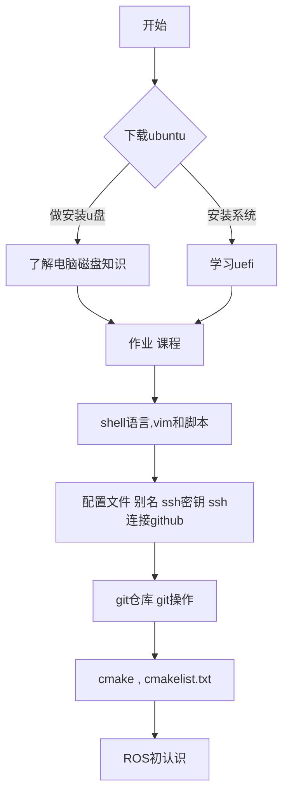

```mermaid
graph TD
    A[开始] --> B{下载ubuntu}
    B -->|做安装u盘| C[了解电脑磁盘知识]
    B -->|安装系统| D[学习uefi]
    C --> E[作业 课程]
    D --> E
    E --> F[shell语言,vim和脚本]
    F --> G[配置文件 别名 ssh密钥 ssh连接github]
    G --> K[git仓库 git操作]
    K --> H[cmake , cmakelist.txt]
    H --> L[ROS初认识]
```