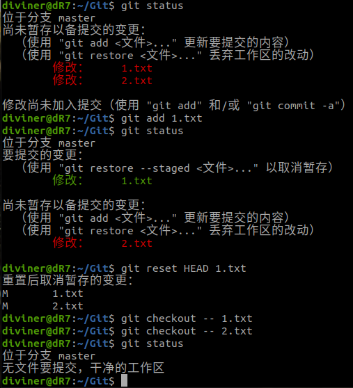
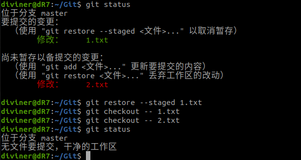
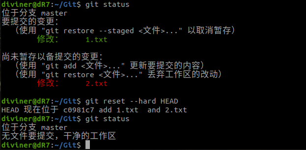
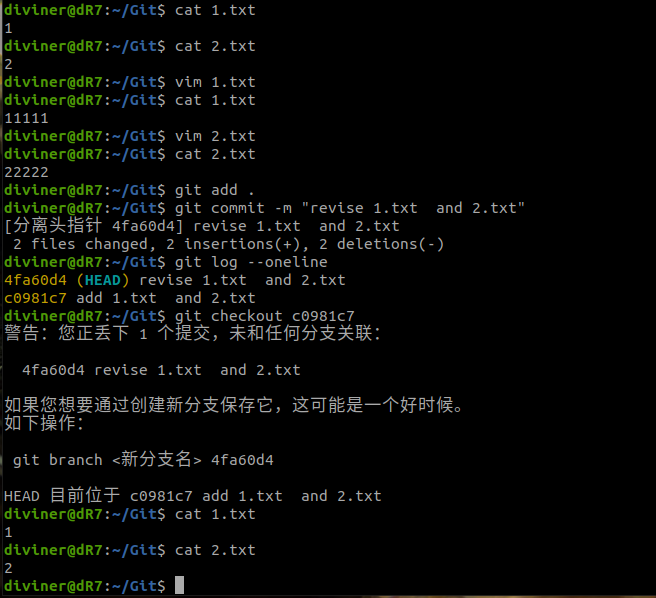
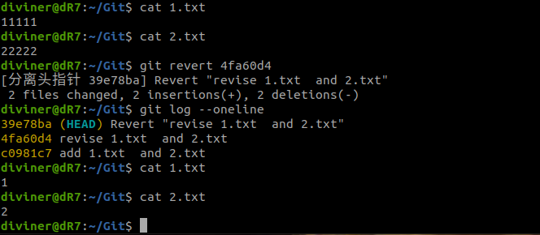
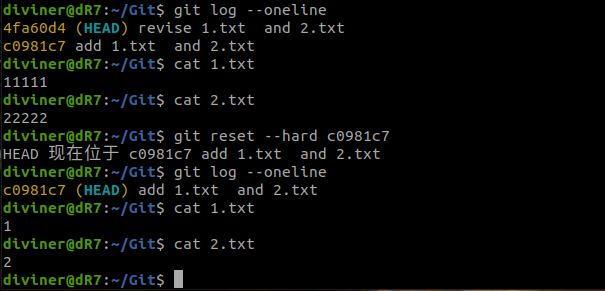
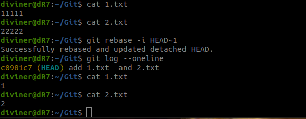
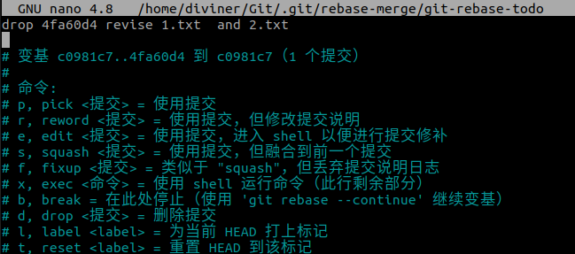
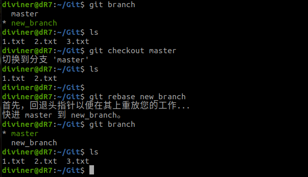
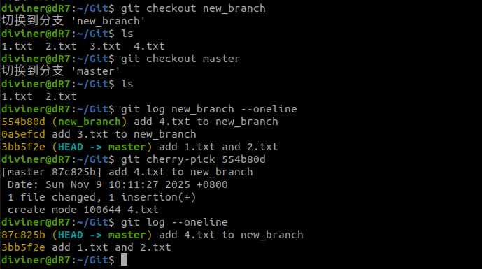

# Git应用问题解答

## 1. 回退修改
### 方式1：git reset HEAD，分步回退

### 方式2：git restore --staged，分步回退

### 方式3：git reset --hard HEAD，强制回退

## 2. 回退已提交的版本
### 不修改历史的方式
#### 方式1：git checkout(临时切换到旧版本)

#### 方式2：git revert(生成“抵消提交”)

### 修改历史的方式
#### 方式1：git reset --hard(删除错误提交)

#### 方式2：git rebase -i（交互式删除提交），进入交互式变基编辑器后将错误提交那行的pick改为drop，可将错误提交在历史记录中删除。

## 3. 合并分支的其他方式
### 方式1：git rebase，使用git rebase进行变基合并，将新分支中的提交变基到master主分支中。

### 方式2：git cherry-pick，使用git cherry-pick挑选指定的提交合并（比如指定将新分支中的4.txt的提交合并到master中）

