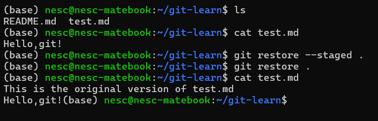
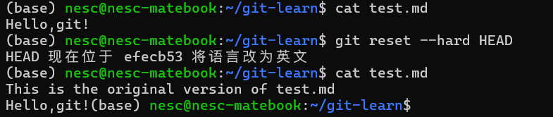
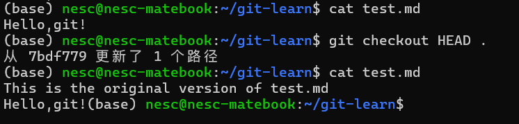
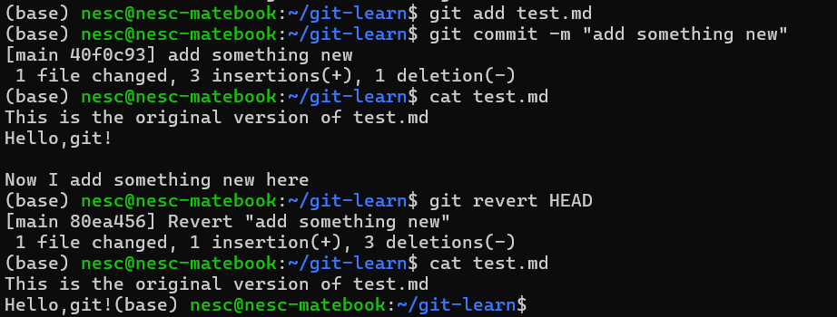
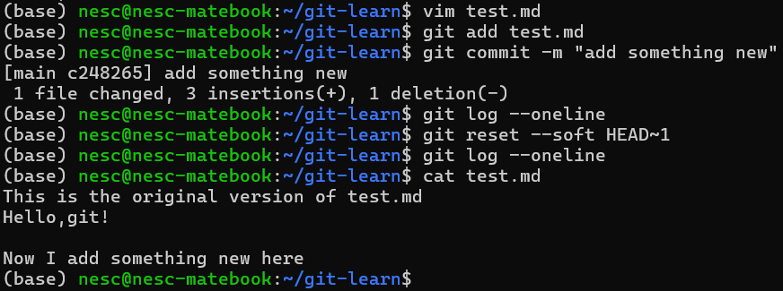
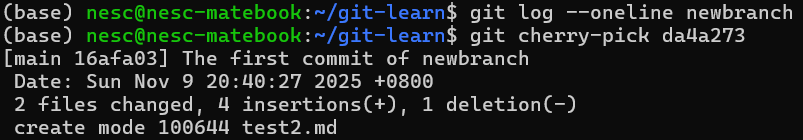
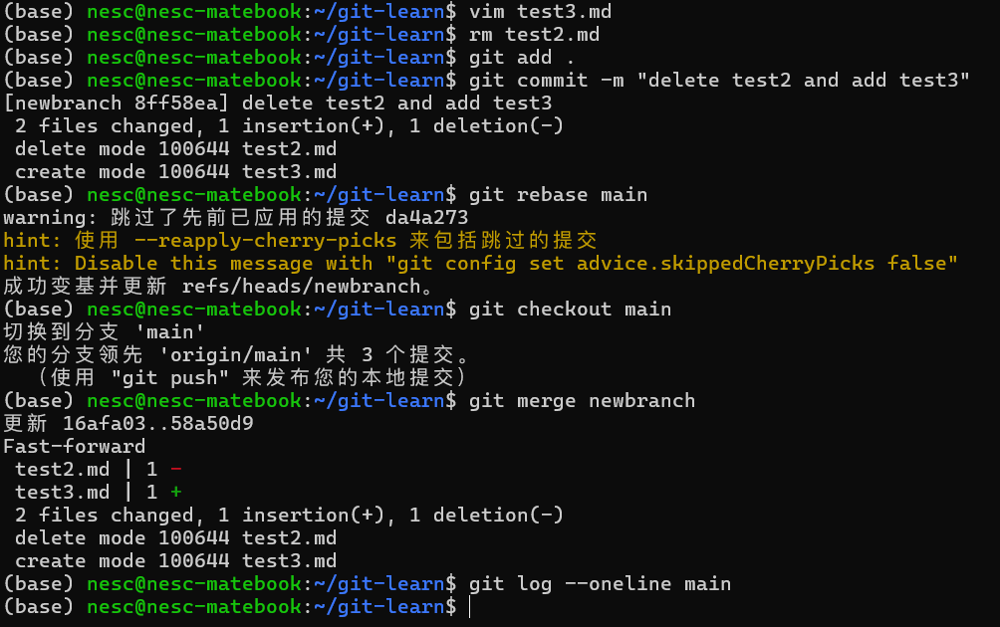

# Git 应用问题回答


## 问题 1: 回退修改，恢复到最后一次提交的状态

**场景：** 已经修改了部分文件，并且将其中一部分加入了暂存区，需要回退这些修改。

### 方法一：`git restore`

#### 1. 取消暂存区的文件
```bash
# 将暂存区的文件恢复到工作区
git restore --staged <file>
# 取消所有暂存的文件
git restore --staged .
```

#### 2. 丢弃工作区的修改
```bash
# 丢弃工作区中某个文件的修改
git restore <file>

# 丢弃所有修改
git restore .
```

**示例：**



如图所示，操作后 `test.md` 的内容退回到了修改前

---

### 方法二：`git reset`

#### 硬重置
```bash
# 同时重置暂存区和工作区到 HEAD
git reset --hard HEAD
```

此方法会永久删除未提交的修改

**示例：**


---

### 方法三：`git checkout`
```bash
# 取消暂存并丢弃修改
git checkout HEAD <file>

# 取消所有修改
git checkout HEAD .
```
**示例：**


---

## 问题 2: 回退已提交的版本

**场景：** 已经提交了一个新版本，需要回退该版本。

### 不修改历史:

#### `git revert`

`git revert` 会创建一个新的提交来撤销之前的提交，不会修改历史记录

```bash
# 撤销最近一次提交
git revert HEAD

# 撤销指定的提交
git revert <commit-hash>
```

**示例：**


---


### 修改历史的方式

修改历史会改变提交的 SHA 值，可能影响其他协作者。

#### `git reset --soft`

保留工作区和暂存区的修改，只移动 HEAD 指针。

```bash
# 回退到上一个提交，保留修改在暂存区
git reset --soft HEAD~1

# 回退到指定提交
git reset --soft <commit-hash>

# 此时可以重新修改后再次提交
git commit -m "New commit message"
```

**示例：**


---


## 问题 3: 合并分支的不同方式

**场景：** 除 `git merge`的其他方式合并分支。

---
### 方法一：`git cherry-pick`

选择性地将其他分支的特定提交应用到当前分支。

```bash
# 切换到目标分支
git checkout main

# 挑选特定的提交
git cherry-pick <commit-hash>

# 挑选多个提交
git cherry-pick <commit1> <commit2>

# 挑选一个范围的提交
git cherry-pick <start-commit>..<end-commit>
```

**示例：**


---


### 方法二：`git rebase`

将当前分支的提交重新应用到目标分支上，创建线性历史。

```bash
# 在 feature 分支上
git checkout feature

# 将 feature 分支变基到 main
git rebase main

# 切换到 main 并快进合并
git checkout main
git merge feature
```

相比直接merge，该方法会把分叉的提交历史整理成一条直线

**示例：**

