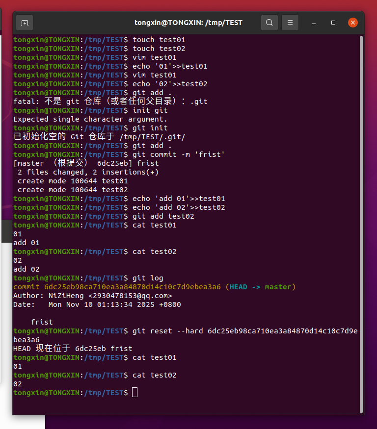
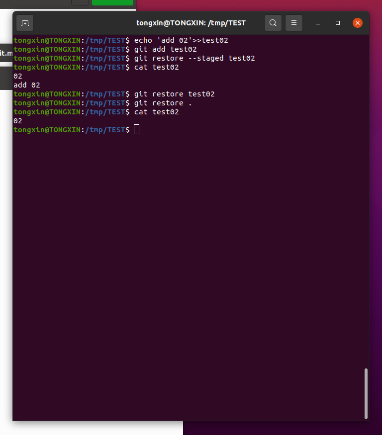
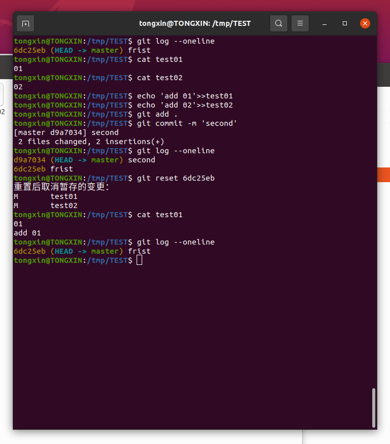
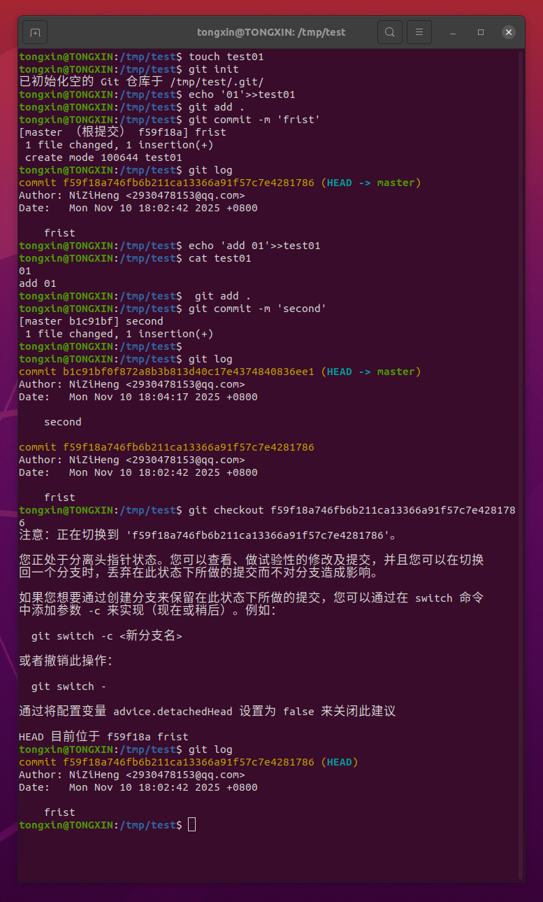
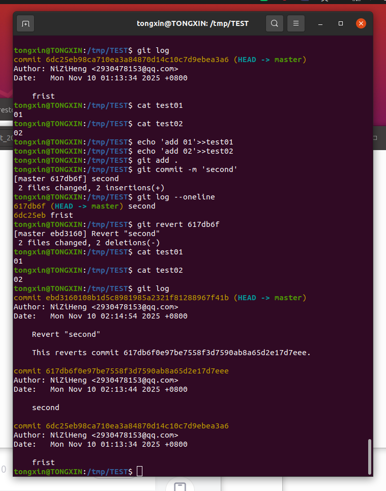
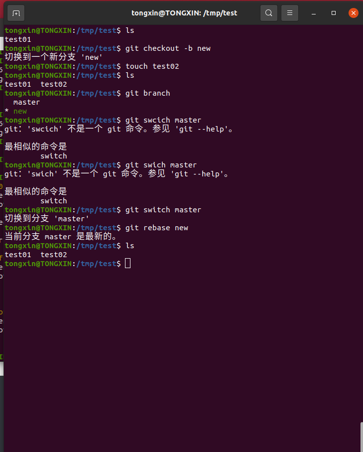
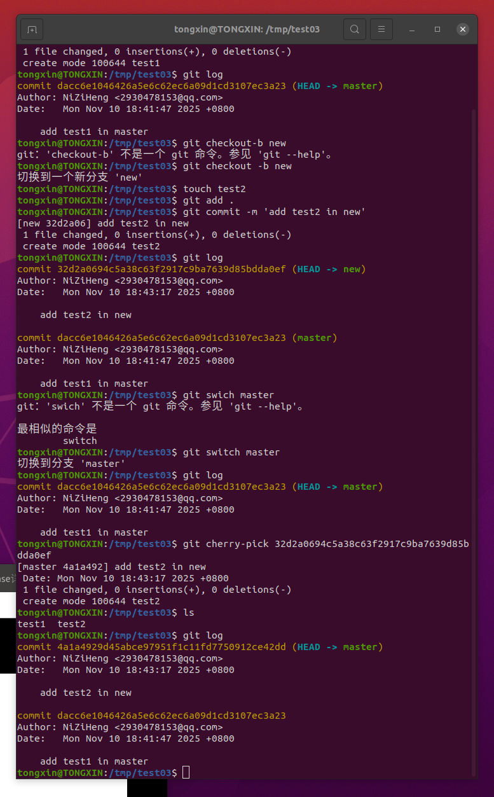

# question1

若你已经修改了部分文件、并且将其中的一部分加入了暂存区，应该如何回退这些修改，恢复到修改前最后一次提交的状态？给出至少两种不同的方式

方式一:用reset --hard :

方法二：用restore取消缓存后恢复

# question2

若你已经提交了一个新版本，需要回退该版本，应该如何操作？分别给出不修改历史或修改历史的至少两种不同的方式

## 修改历史：

方式一：用reset ,如果只是回退版本不用回退工作区和暂存区，哪个参数都可以

方式二：用checkout

## 不修改历史

方式一：用revert

# question 3

我们已经知道了合并分支可以使用 merge，但这不是唯一的方法，给出至少两种不同的合并分支的方式

## 方式一：rebase

## 方式二：merge，与rebase用法基本一样

## 方式三：用cherry-pick

