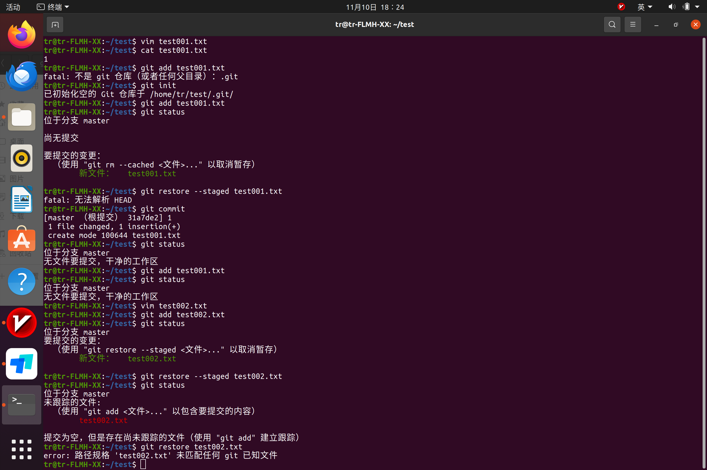
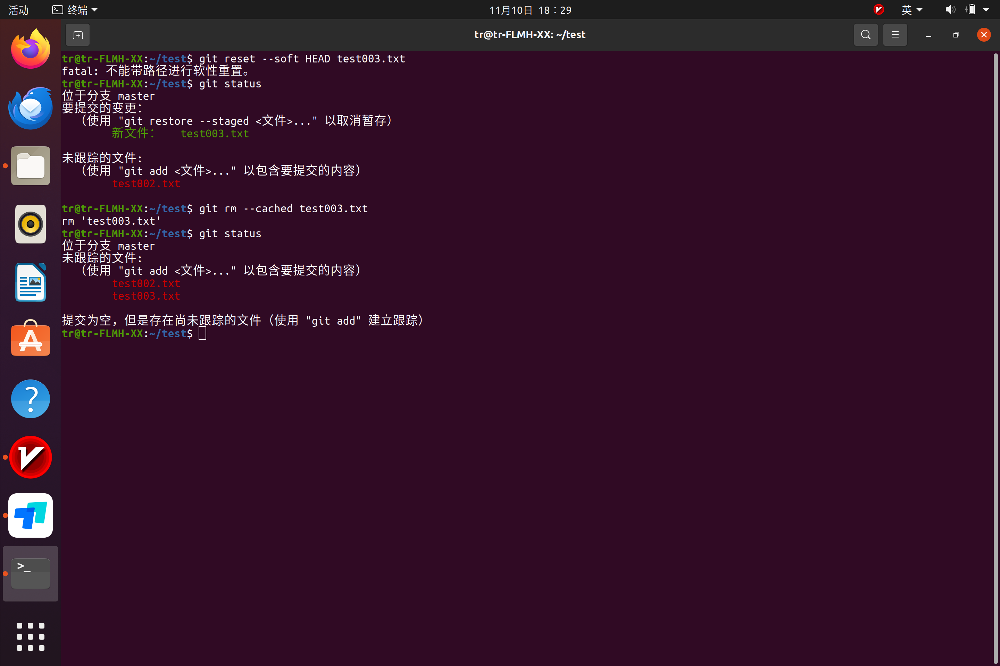
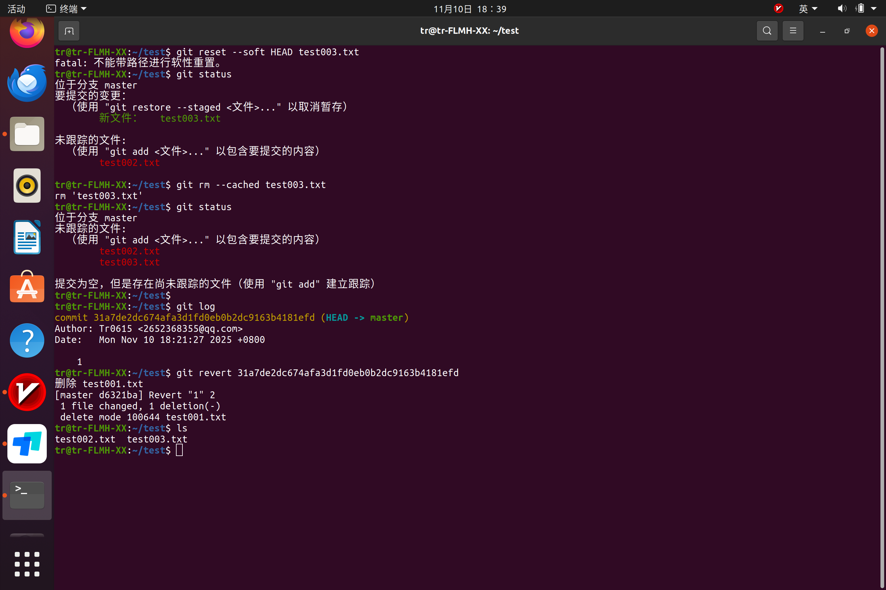
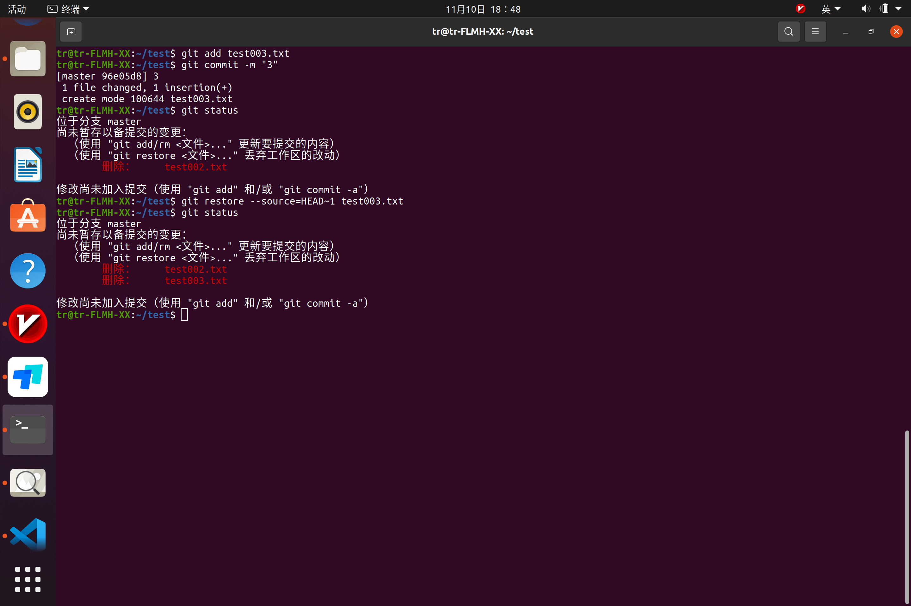
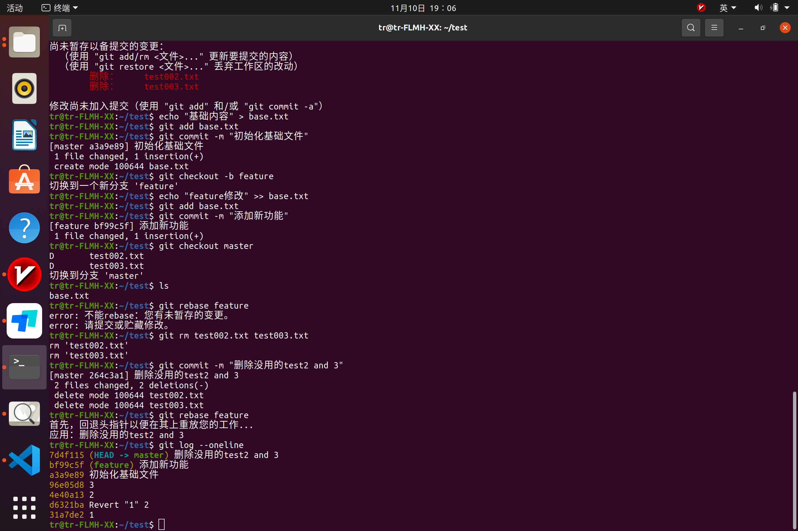
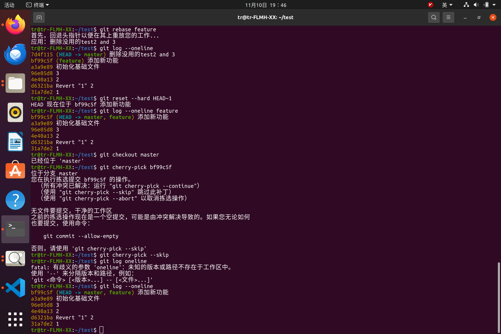

## Git 应用

**要求：** 编写一个文档，回答下列问题，这些问题的答案都应当使用 git 命令实现  
**提交：** 一个 MarkDown 文件和若干个图片文件，在 MarkDown 中使用有效的`相对路径`引用你的图片

1. 若你已经修改了部分文件、并且将其中的一部分加入了暂存区，应该如何回退这些修改，恢复到修改前最后一次提交的状态？给出至少两种不同的方式

方法一:

方法二:

2. 若你已经提交了一个新版本，需要回退该版本，应该如何操作？分别给出不修改历史或修改历史的至少两种不同的方式
我选择不修改历史的两种方法

方法一:

方法二:

3. 我们已经知道了合并分支可以使用 merge，但这不是唯一的方法，给出至少两种不同的合并分支的方式

方法一:

方法二:
