# Git 应用

## 1. 回退未提交文件

### 1.1 分步回退

使用 `git reset`、`git checkout`、`git clean`

```Bash
# 1. 回退暂存区的修改
git reset HEAD

# 2. 回退工作区的所有修改
git checkout -- .
```

**演示：**

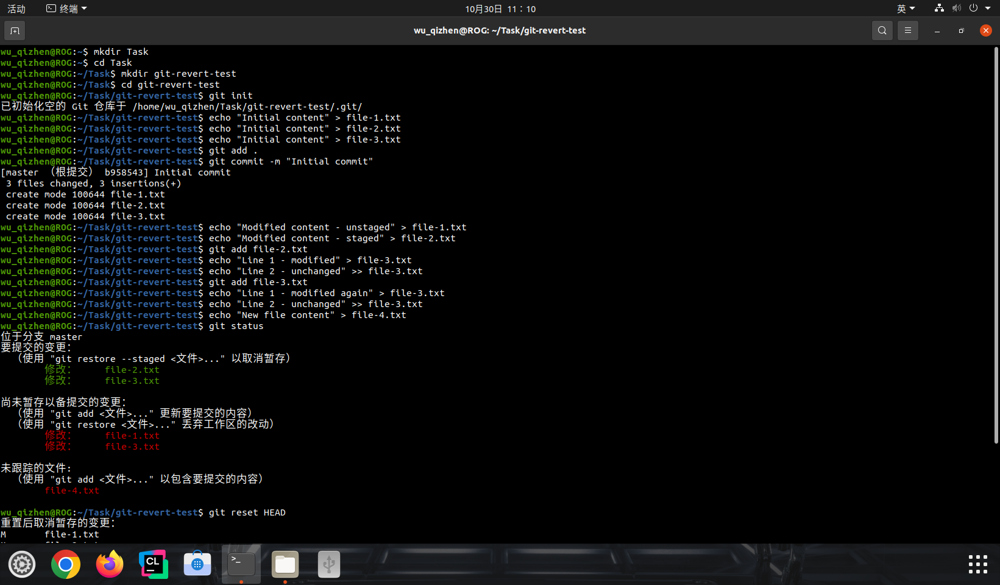

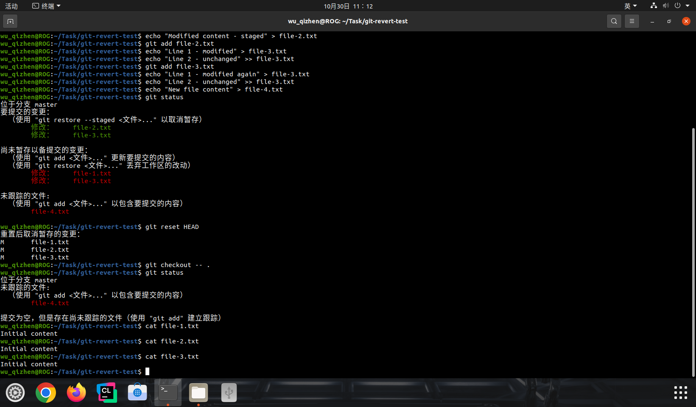

**控制台输出：**

```Bash
wu_qizhen@ROG:~$ mkdir Task
wu_qizhen@ROG:~$ cd Task
wu_qizhen@ROG:~/Task$ mkdir git-revert-test
wu_qizhen@ROG:~/Task$ cd git-revert-test
wu_qizhen@ROG:~/Task/git-revert-test$ git init
已初始化空的 Git 仓库于 /home/wu_qizhen/Task/git-revert-test/.git/
wu_qizhen@ROG:~/Task/git-revert-test$ echo "Initial content" > file-1.txt
wu_qizhen@ROG:~/Task/git-revert-test$ echo "Initial content" > file-2.txt
wu_qizhen@ROG:~/Task/git-revert-test$ echo "Initial content" > file-3.txt
wu_qizhen@ROG:~/Task/git-revert-test$ git add .
wu_qizhen@ROG:~/Task/git-revert-test$ git commit -m "Initial commit"
[master （根提交） b958543] Initial commit
 3 files changed, 3 insertions(+)
 create mode 100644 file-1.txt
 create mode 100644 file-2.txt
 create mode 100644 file-3.txt
wu_qizhen@ROG:~/Task/git-revert-test$ echo "Modified content - unstaged" > file-1.txt
wu_qizhen@ROG:~/Task/git-revert-test$ echo "Modified content - staged" > file-2.txt
wu_qizhen@ROG:~/Task/git-revert-test$ git add file-2.txt
wu_qizhen@ROG:~/Task/git-revert-test$ echo "Line 1 - modified" > file-3.txt
wu_qizhen@ROG:~/Task/git-revert-test$ echo "Line 2 - unchanged" >> file-3.txt
wu_qizhen@ROG:~/Task/git-revert-test$ git add file-3.txt
wu_qizhen@ROG:~/Task/git-revert-test$ echo "Line 1 - modified again" > file-3.txt
wu_qizhen@ROG:~/Task/git-revert-test$ echo "Line 2 - unchanged" >> file-3.txt
wu_qizhen@ROG:~/Task/git-revert-test$ echo "New file content" > file-4.txt
wu_qizhen@ROG:~/Task/git-revert-test$ git status
位于分支 master
要提交的变更：
  （使用 "git restore --staged <文件>..." 以取消暂存）
	修改：     file-2.txt
	修改：     file-3.txt

尚未暂存以备提交的变更：
  （使用 "git add <文件>..." 更新要提交的内容）
  （使用 "git restore <文件>..." 丢弃工作区的改动）
	修改：     file-1.txt
	修改：     file-3.txt

未跟踪的文件:
  （使用 "git add <文件>..." 以包含要提交的内容）
	file-4.txt

wu_qizhen@ROG:~/Task/git-revert-test$ git reset HEAD
重置后取消暂存的变更：
M	file-1.txt
M	file-2.txt
M	file-3.txt
wu_qizhen@ROG:~/Task/git-revert-test$ git checkout -- .
wu_qizhen@ROG:~/Task/git-revert-test$ git status
位于分支 master
未跟踪的文件:
  （使用 "git add <文件>..." 以包含要提交的内容）
	file-4.txt

提交为空，但是存在尚未跟踪的文件（使用 "git add" 建立跟踪）
wu_qizhen@ROG:~/Task/git-revert-test$ cat file-1.txt
Initial content
wu_qizhen@ROG:~/Task/git-revert-test$ cat file-2.txt
Initial content
wu_qizhen@ROG:~/Task/git-revert-test$ cat file-3.txt
Initial content
wu_qizhen@ROG:~/Task/git-revert-test$ 
```

### 1.2 一次性回退

使用 `git reset --hard`、`git clean`

```Bash
# 一次性回退工作区和暂存区的所有修改到最近一次提交
git reset --hard HEAD
```

**演示：**

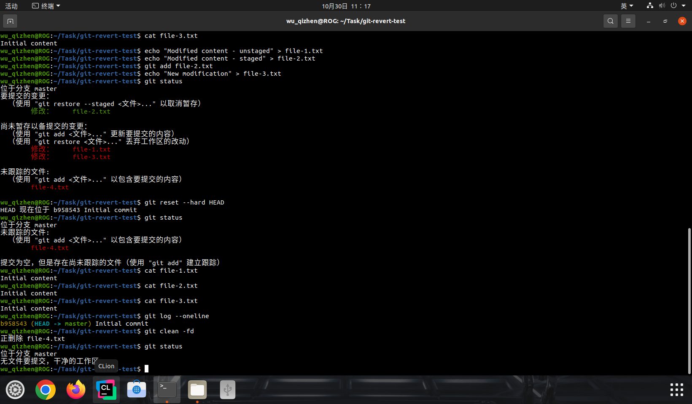

**控制台输出：**

```Bash
wu_qizhen@ROG:~/Task/git-revert-test$ echo "Modified content - staged" > file-2.txt
wu_qizhen@ROG:~/Task/git-revert-test$ git add file-2.txt
wu_qizhen@ROG:~/Task/git-revert-test$ echo "New modification" > file-3.txt
wu_qizhen@ROG:~/Task/git-revert-test$ git status
位于分支 master
要提交的变更：
  （使用 "git restore --staged <文件>..." 以取消暂存）
	修改：     file-2.txt

尚未暂存以备提交的变更：
  （使用 "git add <文件>..." 更新要提交的内容）
  （使用 "git restore <文件>..." 丢弃工作区的改动）
	修改：     file-1.txt
	修改：     file-3.txt

未跟踪的文件:
  （使用 "git add <文件>..." 以包含要提交的内容）
	file-4.txt

wu_qizhen@ROG:~/Task/git-revert-test$ git reset --hard HEAD
HEAD 现在位于 b958543 Initial commit
wu_qizhen@ROG:~/Task/git-revert-test$ git status
位于分支 master
未跟踪的文件:
  （使用 "git add <文件>..." 以包含要提交的内容）
	file-4.txt

提交为空，但是存在尚未跟踪的文件（使用 "git add" 建立跟踪）
wu_qizhen@ROG:~/Task/git-revert-test$ cat file-1.txt
Initial content
wu_qizhen@ROG:~/Task/git-revert-test$ cat file-2.txt
Initial content
wu_qizhen@ROG:~/Task/git-revert-test$ cat file-3.txt
Initial content
wu_qizhen@ROG:~/Task/git-revert-test$ git log --oneline
b958543 (HEAD -> master) Initial commit
wu_qizhen@ROG:~/Task/git-revert-test$ git clean -fd
正删除 file-4.txt
wu_qizhen@ROG:~/Task/git-revert-test$ git status
位于分支 master
无文件要提交，干净的工作区
wu_qizhen@ROG:~/Task/git-revert-test$ 
```

### 1.3 临时保存并清理

使用 `git stash`

```Bash
# 1. 将所有修改（包括暂存区）保存到储藏栈
git stash push --include-untracked

# 2. 清空储藏栈，彻底删除修改
git stash drop
```

**演示：**

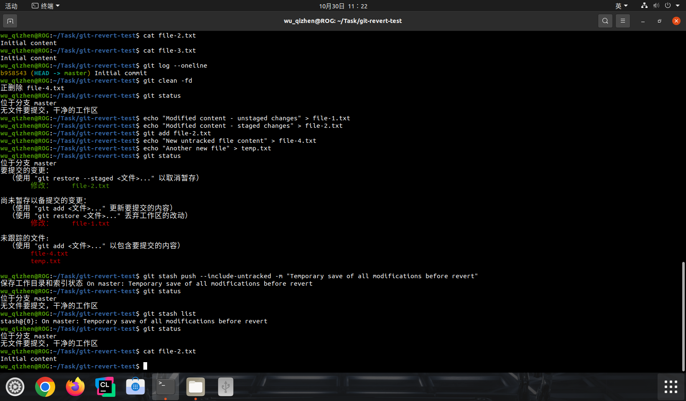

**控制台输出：**

```Bash
wu_qizhen@ROG:~/Task/git-revert-test$ echo "Modified content - unstaged changes" > file-1.txt
wu_qizhen@ROG:~/Task/git-revert-test$ echo "Modified content - staged changes" > file-2.txt
wu_qizhen@ROG:~/Task/git-revert-test$ git add file-2.txt
wu_qizhen@ROG:~/Task/git-revert-test$ echo "New untracked file content" > file-4.txt
wu_qizhen@ROG:~/Task/git-revert-test$ echo "Another new file" > temp.txt
wu_qizhen@ROG:~/Task/git-revert-test$ git status
位于分支 master
要提交的变更：
  （使用 "git restore --staged <文件>..." 以取消暂存）
	修改：     file-2.txt

尚未暂存以备提交的变更：
  （使用 "git add <文件>..." 更新要提交的内容）
  （使用 "git restore <文件>..." 丢弃工作区的改动）
	修改：     file-1.txt

未跟踪的文件:
  （使用 "git add <文件>..." 以包含要提交的内容）
	file-4.txt
	temp.txt

wu_qizhen@ROG:~/Task/git-revert-test$ git stash push --include-untracked -m "Temporary save of all modifications before revert"
保存工作目录和索引状态 On master: Temporary save of all modifications before revert
wu_qizhen@ROG:~/Task/git-revert-test$ git status
位于分支 master
无文件要提交，干净的工作区
wu_qizhen@ROG:~/Task/git-revert-test$ git stash list
stash@{0}: On master: Temporary save of all modifications before revert
wu_qizhen@ROG:~/Task/git-revert-test$ git status
位于分支 master
无文件要提交，干净的工作区
wu_qizhen@ROG:~/Task/git-revert-test$ cat file-2.txt
Initial content
wu_qizhen@ROG:~/Task/git-revert-test$ 
```


## 2. 回退已提交版本

### 2.1 不修改历史的方式

#### 2.1.1 创建反向提交

使用 `git revert`

```Bash
# 回退最近一次提交
git revert HEAD

# 回退指定提交
git revert <commit-hash>

# 回退多个连续提交
git revert <commit1>..<commit2>
```

**演示：**

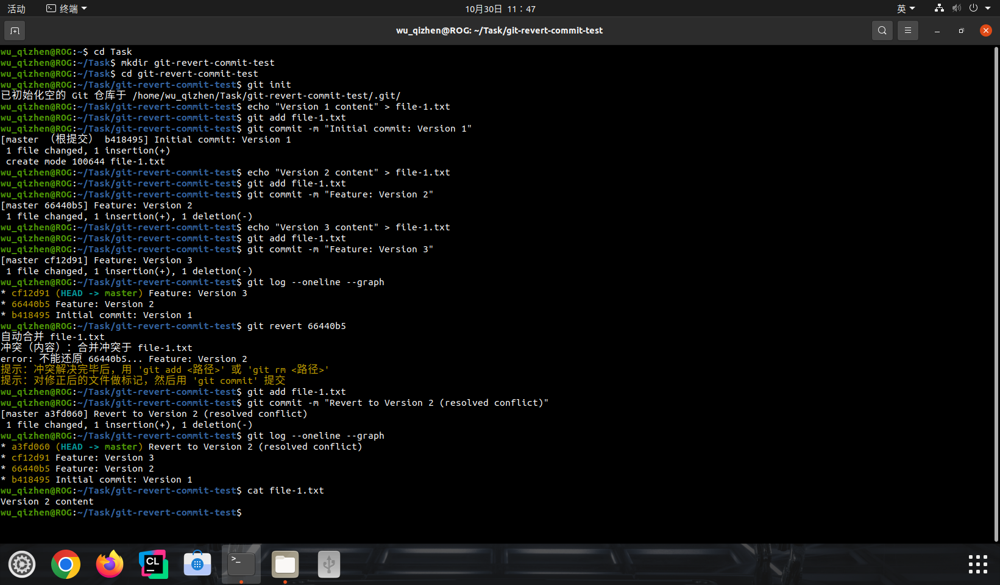

**控制台输出：**

```Bash
wu_qizhen@ROG:~/Task/git-revert-commit-test$ echo "Version 1 content" > file-1.txt
wu_qizhen@ROG:~/Task/git-revert-commit-test$ git add file-1.txt
wu_qizhen@ROG:~/Task/git-revert-commit-test$ git commit -m "Initial commit: Version 1"
[master （根提交） b418495] Initial commit: Version 1
 1 file changed, 1 insertion(+)
 create mode 100644 file-1.txt
wu_qizhen@ROG:~/Task/git-revert-commit-test$ echo "Version 2 content" > file-1.txt
wu_qizhen@ROG:~/Task/git-revert-commit-test$ git add file-1.txt
wu_qizhen@ROG:~/Task/git-revert-commit-test$ git commit -m "Feature: Version 2"
[master 66440b5] Feature: Version 2
 1 file changed, 1 insertion(+), 1 deletion(-)
wu_qizhen@ROG:~/Task/git-revert-commit-test$ echo "Version 3 content" > file-1.txt
wu_qizhen@ROG:~/Task/git-revert-commit-test$ git add file-1.txt
wu_qizhen@ROG:~/Task/git-revert-commit-test$ git commit -m "Feature: Version 3"
[master cf12d91] Feature: Version 3
 1 file changed, 1 insertion(+), 1 deletion(-)
wu_qizhen@ROG:~/Task/git-revert-commit-test$ git log --oneline --graph
* cf12d91 (HEAD -> master) Feature: Version 3
* 66440b5 Feature: Version 2
* b418495 Initial commit: Version 1
wu_qizhen@ROG:~/Task/git-revert-commit-test$ git revert 66440b5
自动合并 file-1.txt
冲突（内容）：合并冲突于 file-1.txt
error: 不能还原 66440b5... Feature: Version 2
提示：冲突解决完毕后，用 'git add <路径>' 或 'git rm <路径>'
提示：对修正后的文件做标记，然后用 'git commit' 提交
wu_qizhen@ROG:~/Task/git-revert-commit-test$ git add file-1.txt
wu_qizhen@ROG:~/Task/git-revert-commit-test$ git commit -m "Revert to Version 2 (resolved conflict)"
[master a3fd060] Revert to Version 2 (resolved conflict)
 1 file changed, 1 insertion(+), 1 deletion(-)
wu_qizhen@ROG:~/Task/git-revert-commit-test$ git log --oneline --graph
* a3fd060 (HEAD -> master) Revert to Version 2 (resolved conflict)
* cf12d91 Feature: Version 3
* 66440b5 Feature: Version 2
* b418495 Initial commit: Version 1
wu_qizhen@ROG:~/Task/git-revert-commit-test$ cat file-1.txt
Version 2 content
wu_qizhen@ROG:~/Task/git-revert-commit-test$ 
```

#### 2.1.2 不自动提交

使用 `git revert`

```Bash
# 回退但不自动提交，可以修改回退信息
git revert --no-commit HEAD

# 手动修改后提交
git commit -m "Revert: ..."
```

**演示：**

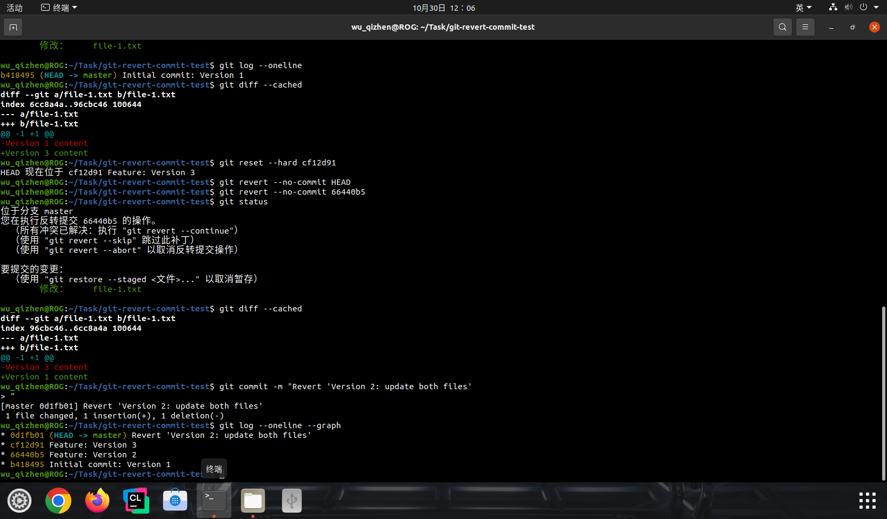

**控制台输出：**

```Bash
wu_qizhen@ROG:~/Task/git-revert-commit-test$ git revert --no-commit 66440b5
wu_qizhen@ROG:~/Task/git-revert-commit-test$ git status
位于分支 master
您在执行反转提交 66440b5 的操作。
  （所有冲突已解决：执行 "git revert --continue"）
  （使用 "git revert --skip" 跳过此补丁）
  （使用 "git revert --abort" 以取消反转提交操作）

要提交的变更：
  （使用 "git restore --staged <文件>..." 以取消暂存）
	修改：     file-1.txt

wu_qizhen@ROG:~/Task/git-revert-commit-test$ git diff --cached
diff --git a/file-1.txt b/file-1.txt
index 96cbc46..6cc8a4a 100644
--- a/file-1.txt
+++ b/file-1.txt
@@ -1 +1 @@
-Version 3 content
+Version 1 content
wu_qizhen@ROG:~/Task/git-revert-commit-test$ git commit -m "Revert 'Version 2: update both files'
> "
[master 0d1fb01] Revert 'Version 2: update both files'
 1 file changed, 1 insertion(+), 1 deletion(-)
wu_qizhen@ROG:~/Task/git-revert-commit-test$ git log --oneline --graph
* 0d1fb01 (HEAD -> master) Revert 'Version 2: update both files'
* cf12d91 Feature: Version 3
* 66440b5 Feature: Version 2
* b418495 Initial commit: Version 1
wu_qizhen@ROG:~/Task/git-revert-commit-test$ 
```

### 2.2 修改历史的方式

#### 2.2.1 软重置

使用 `git reset --soft`

```Bash
# 回退到指定提交，保留修改在工作区
git reset --soft <commit-hash>

# 回退到上一个提交
git reset --soft HEAD~1
```

**演示：**

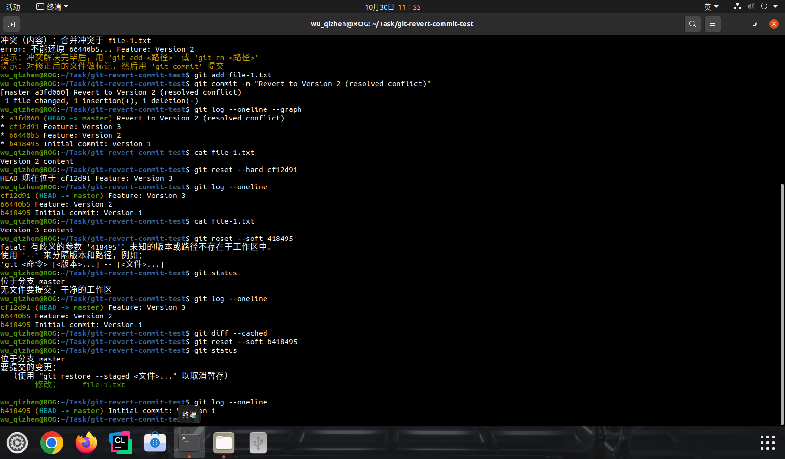

**控制台输出：**

```
wu_qizhen@ROG:~/Task/git-revert-commit-test$ git reset --soft b418495
wu_qizhen@ROG:~/Task/git-revert-commit-test$ git status
位于分支 master
要提交的变更：
  （使用 "git restore --staged <文件>..." 以取消暂存）
	修改：     file-1.txt

wu_qizhen@ROG:~/Task/git-revert-commit-test$ git log --oneline
b418495 (HEAD -> master) Initial commit: Version 1
wu_qizhen@ROG:~/Task/git-revert-commit-test$ git diff --cached
diff --git a/file-1.txt b/file-1.txt
index 6cc8a4a..96cbc46 100644
--- a/file-1.txt
+++ b/file-1.txt
@@ -1 +1 @@
-Version 1 content
+Version 3 content
wu_qizhen@ROG:~/Task/git-revert-commit-test$ 
```

#### 2.2.2 硬重置

使用 `git reset --hard`

```Bash
# 回退到指定提交，丢弃所有修改
git reset --hard <commit-hash>

# 回退到上一个提交
git reset --hard HEAD~1
```

**演示：**

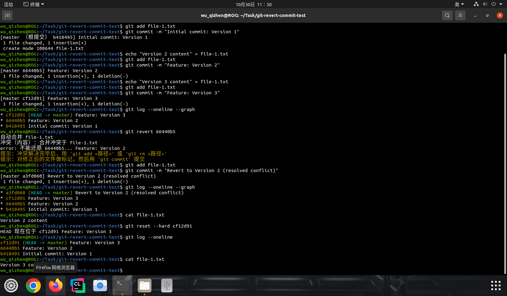

**控制台输出：**

```Bash
wu_qizhen@ROG:~/Task/git-revert-commit-test$ git reset --hard cf12d91
HEAD 现在位于 cf12d91 Feature: Version 3
wu_qizhen@ROG:~/Task/git-revert-commit-test$ git log --oneline
cf12d91 (HEAD -> master) Feature: Version 3
66440b5 Feature: Version 2
b418495 Initial commit: Version 1
wu_qizhen@ROG:~/Task/git-revert-commit-test$ cat file-1.txt
Version 3 content
wu_qizhen@ROG:~/Task/git-revert-commit-test$ 
```

#### 2.2.3 交互式重写历史

使用 `git rebase`

```Bash
# 重写最近 3 个提交
git rebase -i HEAD~3
# 在编辑器中标记要删除的提交为 'drop' 或 'd'
```


## 3. 分支合并方式

### 3.1 常规合并

使用 `git merge`

```Bash
# 1. 切换到目标分支
git checkout main

# 2. 合并特性分支
git merge feature-branch

# 3. 如果需要，解决冲突后提交
git commit -m "Merge feature-branch into main"
```

**演示：**

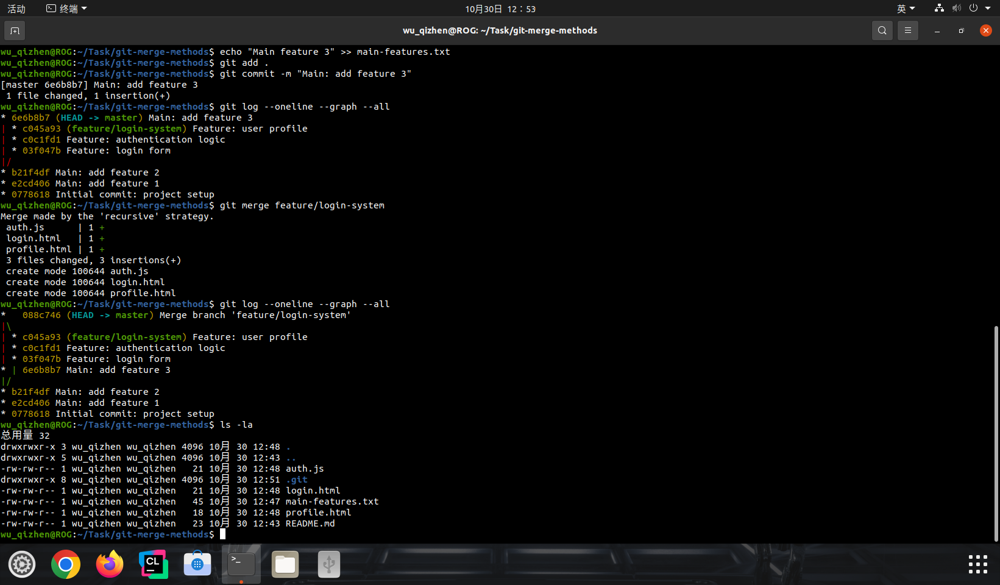

**控制台输出：**

```Bash
wu_qizhen@ROG:~$ cd Task
wu_qizhen@ROG:~/Task$ mkdir git-merge-methods
wu_qizhen@ROG:~/Task$ cd git-merge-methods
wu_qizhen@ROG:~/Task/git-merge-methods$ git init
已初始化空的 Git 仓库于 /home/wu_qizhen/Task/git-merge-methods/.git/
wu_qizhen@ROG:~/Task/git-merge-methods$ echo "Base project structure" > README.md
wu_qizhen@ROG:~/Task/git-merge-methods$ git add .
wu_qizhen@ROG:~/Task/git-merge-methods$ git commit -m "Initial commit: project setup"
[master （根提交） 0778618] Initial commit: project setup
 1 file changed, 1 insertion(+)
 create mode 100644 README.md
wu_qizhen@ROG:~/Task/git-merge-methods$ echo "Main feature 1" >> main-features.txt
wu_qizhen@ROG:~/Task/git-merge-methods$ git add .
wu_qizhen@ROG:~/Task/git-merge-methods$ git commit -m "Main: add feature 1"
[master e2cd406] Main: add feature 1
 1 file changed, 1 insertion(+)
 create mode 100644 main-features.txt
wu_qizhen@ROG:~/Task/git-merge-methods$ echo "Main feature 2" >> main-features.txt
wu_qizhen@ROG:~/Task/git-merge-methods$ git add .
wu_qizhen@ROG:~/Task/git-merge-methods$ git commit -m "Main: add feature 2"
[master b21f4df] Main: add feature 2
 1 file changed, 1 insertion(+)
wu_qizhen@ROG:~/Task/git-merge-methods$ git log --oneline
b21f4df (HEAD -> master) Main: add feature 2
e2cd406 Main: add feature 1
0778618 Initial commit: project setup
wu_qizhen@ROG:~/Task/git-merge-methods$ git checkout -b feature/login-system
切换到一个新分支 'feature/login-system'
wu_qizhen@ROG:~/Task/git-merge-methods$ echo "Login form component" > login.html
wu_qizhen@ROG:~/Task/git-merge-methods$ git add .
wu_qizhen@ROG:~/Task/git-merge-methods$ git commit -m "Feature: login form"
[feature/login-system 03f047b] Feature: login form
 1 file changed, 1 insertion(+)
 create mode 100644 login.html
wu_qizhen@ROG:~/Task/git-merge-methods$ echo "Authentication logic" > auth.js
wu_qizhen@ROG:~/Task/git-merge-methods$ git add .
wu_qizhen@ROG:~/Task/git-merge-methods$ git commit -m "Feature: authentication logic"
[feature/login-system c0c1fd1] Feature: authentication logic
 1 file changed, 1 insertion(+)
 create mode 100644 auth.js
wu_qizhen@ROG:~/Task/git-merge-methods$ echo "User profile page" > profile.html
wu_qizhen@ROG:~/Task/git-merge-methods$ git add .
wu_qizhen@ROG:~/Task/git-merge-methods$ git commit -m "Feature: user profile"
[feature/login-system c045a93] Feature: user profile
 1 file changed, 1 insertion(+)
 create mode 100644 profile.html
wu_qizhen@ROG:~/Task/git-merge-methods$ git log --oneline --graph
* c045a93 (HEAD -> feature/login-system) Feature: user profile
* c0c1fd1 Feature: authentication logic
* 03f047b Feature: login form
* b21f4df (master) Main: add feature 2
* e2cd406 Main: add feature 1
* 0778618 Initial commit: project setup
wu_qizhen@ROG:~/Task/git-merge-methods$ git checkout main
error: 路径规格 'main' 未匹配任何 git 已知文件
wu_qizhen@ROG:~/Task/git-merge-methods$ git checkout master
切换到分支 'master'
wu_qizhen@ROG:~/Task/git-merge-methods$ echo "Main feature 3" >> main-features.txt
wu_qizhen@ROG:~/Task/git-merge-methods$ git add .
wu_qizhen@ROG:~/Task/git-merge-methods$ git commit -m "Main: add feature 3"
[master 6e6b8b7] Main: add feature 3
 1 file changed, 1 insertion(+)
wu_qizhen@ROG:~/Task/git-merge-methods$ git log --oneline --graph --all
* 6e6b8b7 (HEAD -> master) Main: add feature 3
| * c045a93 (feature/login-system) Feature: user profile
| * c0c1fd1 Feature: authentication logic
| * 03f047b Feature: login form
|/  
* b21f4df Main: add feature 2
* e2cd406 Main: add feature 1
* 0778618 Initial commit: project setup
wu_qizhen@ROG:~/Task/git-merge-methods$ git merge feature/login-system
Merge made by the 'recursive' strategy.
 auth.js      | 1 +
 login.html   | 1 +
 profile.html | 1 +
 3 files changed, 3 insertions(+)
 create mode 100644 auth.js
 create mode 100644 login.html
 create mode 100644 profile.html
wu_qizhen@ROG:~/Task/git-merge-methods$ git log --oneline --graph --all
*   088c746 (HEAD -> master) Merge branch 'feature/login-system'
|\  
| * c045a93 (feature/login-system) Feature: user profile
| * c0c1fd1 Feature: authentication logic
| * 03f047b Feature: login form
* | 6e6b8b7 Main: add feature 3
|/  
* b21f4df Main: add feature 2
* e2cd406 Main: add feature 1
* 0778618 Initial commit: project setup
wu_qizhen@ROG:~/Task/git-merge-methods$ ls -la
总用量 32
drwxrwxr-x 3 wu_qizhen wu_qizhen 4096 10月 30 12:48 .
drwxrwxr-x 5 wu_qizhen wu_qizhen 4096 10月 30 12:43 ..
-rw-rw-r-- 1 wu_qizhen wu_qizhen   21 10月 30 12:48 auth.js
drwxrwxr-x 8 wu_qizhen wu_qizhen 4096 10月 30 12:51 .git
-rw-rw-r-- 1 wu_qizhen wu_qizhen   21 10月 30 12:48 login.html
-rw-rw-r-- 1 wu_qizhen wu_qizhen   45 10月 30 12:47 main-features.txt
-rw-rw-r-- 1 wu_qizhen wu_qizhen   18 10月 30 12:48 profile.html
-rw-rw-r-- 1 wu_qizhen wu_qizhen   23 10月 30 12:43 README.md
wu_qizhen@ROG:~/Task/git-merge-methods$ 
```

### 3.2 变基合并

使用 `git rebase`

```Bash
# 1. 切换到特性分支
git checkout feature-branch

# 2. 变基到目标分支
git rebase main

# 3. 切换到目标分支并快进合并
git checkout main
git merge feature-branch
```

**演示：**

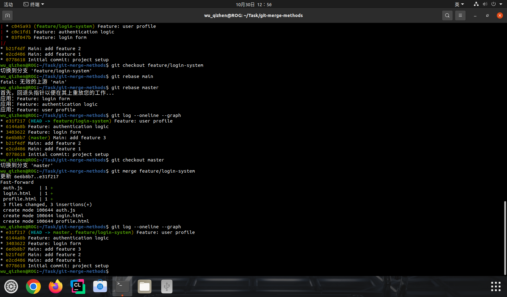

**控制台输出：**

```Bash
wu_qizhen@ROG:~/Task/git-merge-methods$ git checkout feature/login-system
切换到分支 'feature/login-system'
wu_qizhen@ROG:~/Task/git-merge-methods$ git rebase main
fatal: 无效的上游 'main'
wu_qizhen@ROG:~/Task/git-merge-methods$ git rebase master
首先，回退头指针以便在其上重放您的工作...
应用：Feature: login form
应用：Feature: authentication logic
应用：Feature: user profile
wu_qizhen@ROG:~/Task/git-merge-methods$ git log --oneline --graph
* e31f217 (HEAD -> feature/login-system) Feature: user profile
* 6144a8b Feature: authentication logic
* 3403622 Feature: login form
* 6e6b8b7 (master) Main: add feature 3
* b21f4df Main: add feature 2
* e2cd406 Main: add feature 1
* 0778618 Initial commit: project setup
wu_qizhen@ROG:~/Task/git-merge-methods$ git checkout master
切换到分支 'master'
wu_qizhen@ROG:~/Task/git-merge-methods$ git merge feature/login-system
更新 6e6b8b7..e31f217
Fast-forward
 auth.js      | 1 +
 login.html   | 1 +
 profile.html | 1 +
 3 files changed, 3 insertions(+)
 create mode 100644 auth.js
 create mode 100644 login.html
 create mode 100644 profile.html
wu_qizhen@ROG:~/Task/git-merge-methods$ git log --oneline --graph
* e31f217 (HEAD -> master, feature/login-system) Feature: user profile
* 6144a8b Feature: authentication logic
* 3403622 Feature: login form
* 6e6b8b7 Main: add feature 3
* b21f4df Main: add feature 2
* e2cd406 Main: add feature 1
* 0778618 Initial commit: project setup
wu_qizhen@ROG:~/Task/git-merge-methods$ 
```

### 3.3 压缩合并

使用 `git merge --squash`

```Bash
# 1. 切换到目标分支
git checkout main

# 2. 压缩合并特性分支
git merge --squash feature-branch

# 3. 提交压缩后的更改
git commit -m "Squash merge feature-branch"
```

**演示：**

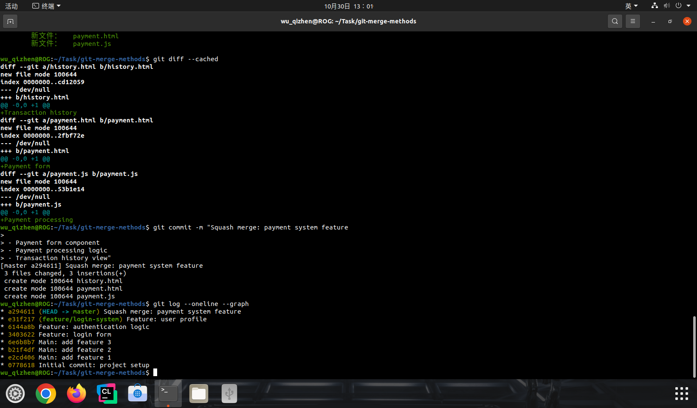

**控制台输出：**

```Bash
wu_qizhen@ROG:~/Task/git-merge-methods$ git checkout -b feature/payment-system
切换到一个新分支 'feature/payment-system'
wu_qizhen@ROG:~/Task/git-merge-methods$ echo "Payment form" > payment.html
wu_qizhen@ROG:~/Task/git-merge-methods$ git add .
wu_qizhen@ROG:~/Task/git-merge-methods$ git commit -m "Feature: payment form"
[feature/payment-system 7cfd8b8] Feature: payment form
 1 file changed, 1 insertion(+)
 create mode 100644 payment.html
wu_qizhen@ROG:~/Task/git-merge-methods$ echo "Payment processing" > payment.js
wu_qizhen@ROG:~/Task/git-merge-methods$ git add .
wu_qizhen@ROG:~/Task/git-merge-methods$ git commit -m "Feature: payment processing"
[feature/payment-system d9a5653] Feature: payment processing
 1 file changed, 1 insertion(+)
 create mode 100644 payment.js
wu_qizhen@ROG:~/Task/git-merge-methods$ echo "Transaction history" > history.html
wu_qizhen@ROG:~/Task/git-merge-methods$ git add .
wu_qizhen@ROG:~/Task/git-merge-methods$ git commit -m "Feature: transaction history"
[feature/payment-system 6e2f329] Feature: transaction history
 1 file changed, 1 insertion(+)
 create mode 100644 history.html
wu_qizhen@ROG:~/Task/git-merge-methods$ git log --oneline
6e2f329 (HEAD -> feature/payment-system) Feature: transaction history
d9a5653 Feature: payment processing
7cfd8b8 Feature: payment form
e31f217 (master, feature/login-system) Feature: user profile
6144a8b Feature: authentication logic
3403622 Feature: login form
6e6b8b7 Main: add feature 3
b21f4df Main: add feature 2
e2cd406 Main: add feature 1
0778618 Initial commit: project setup
wu_qizhen@ROG:~/Task/git-merge-methods$ git checkout master
切换到分支 'master'
wu_qizhen@ROG:~/Task/git-merge-methods$ git merge --squash feature/payment-system
更新 e31f217..6e2f329
Fast-forward
挤压提交 -- 未更新 HEAD
 history.html | 1 +
 payment.html | 1 +
 payment.js   | 1 +
 3 files changed, 3 insertions(+)
 create mode 100644 history.html
 create mode 100644 payment.html
 create mode 100644 payment.js
wu_qizhen@ROG:~/Task/git-merge-methods$ git status
位于分支 master
要提交的变更：
  （使用 "git restore --staged <文件>..." 以取消暂存）
	新文件：   history.html
	新文件：   payment.html
	新文件：   payment.js

wu_qizhen@ROG:~/Task/git-merge-methods$ git diff --cached
diff --git a/history.html b/history.html
new file mode 100644
index 0000000..cd12059
--- /dev/null
+++ b/history.html
@@ -0,0 +1 @@
+Transaction history
diff --git a/payment.html b/payment.html
new file mode 100644
index 0000000..2fbf72e
--- /dev/null
+++ b/payment.html
@@ -0,0 +1 @@
+Payment form
diff --git a/payment.js b/payment.js
new file mode 100644
index 0000000..53b1e14
--- /dev/null
+++ b/payment.js
@@ -0,0 +1 @@
+Payment processing
wu_qizhen@ROG:~/Task/git-merge-methods$ git commit -m "Squash merge: payment system feature
> 
> - Payment form component
> - Payment processing logic  
> - Transaction history view"
[master a294611] Squash merge: payment system feature
 3 files changed, 3 insertions(+)
 create mode 100644 history.html
 create mode 100644 payment.html
 create mode 100644 payment.js
wu_qizhen@ROG:~/Task/git-merge-methods$ git log --oneline --graph
* a294611 (HEAD -> master) Squash merge: payment system feature
* e31f217 (feature/login-system) Feature: user profile
* 6144a8b Feature: authentication logic
* 3403622 Feature: login form
* 6e6b8b7 Main: add feature 3
* b21f4df Main: add feature 2
* e2cd406 Main: add feature 1
* 0778618 Initial commit: project setup
wu_qizhen@ROG:~/Task/git-merge-methods$ 
```

### 3.4 选择性合并

使用 `git cherry-pick`

```Bash
# 1. 切换到目标分支
git checkout main

# 2. 选择性地合并特定提交
git cherry-pick <commit-hash>

# 3. 或多个提交
git cherry-pick <commit1> <commit2> <commit3>
```