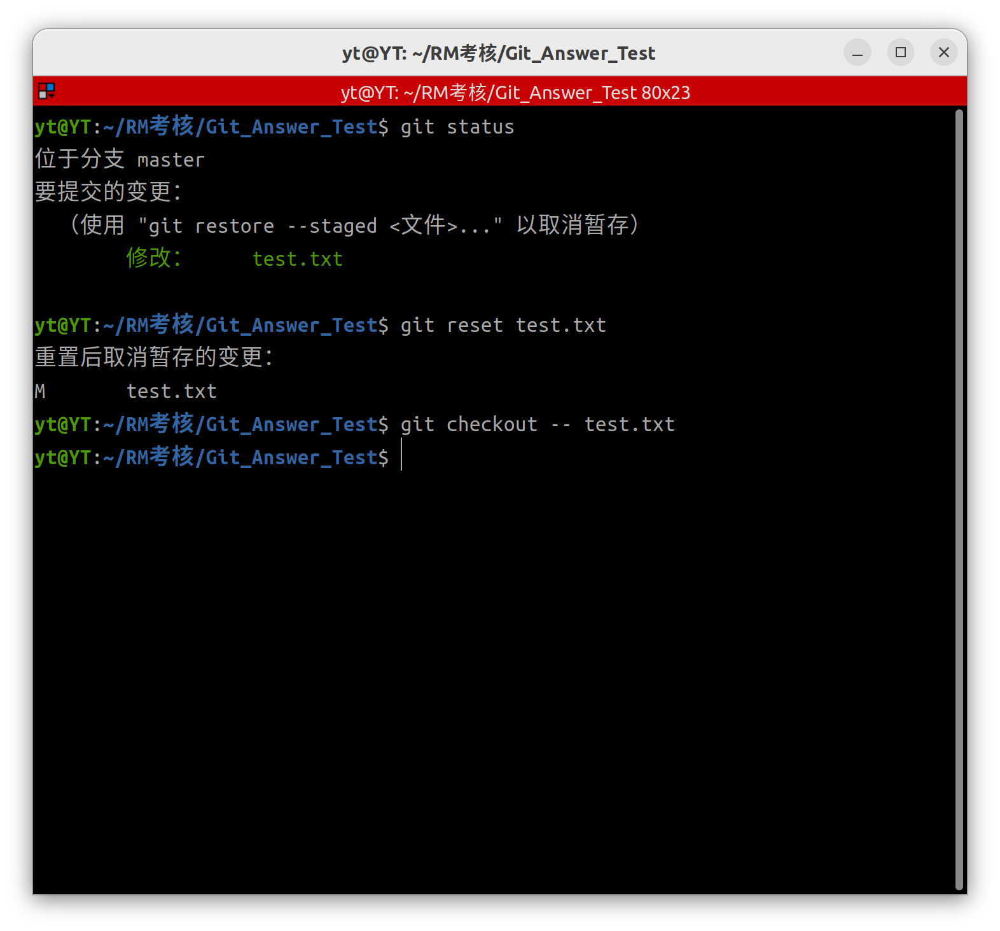
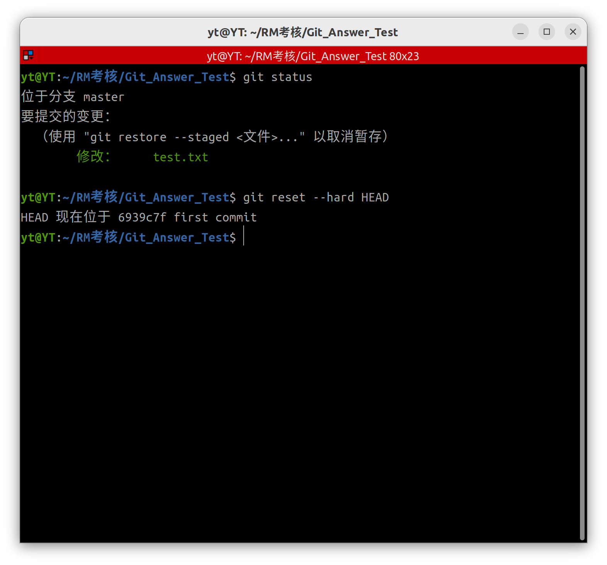
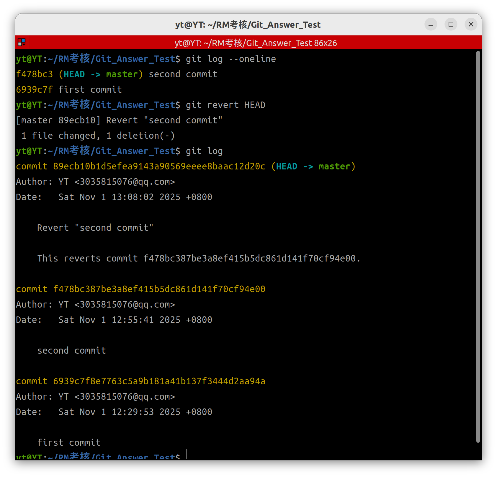
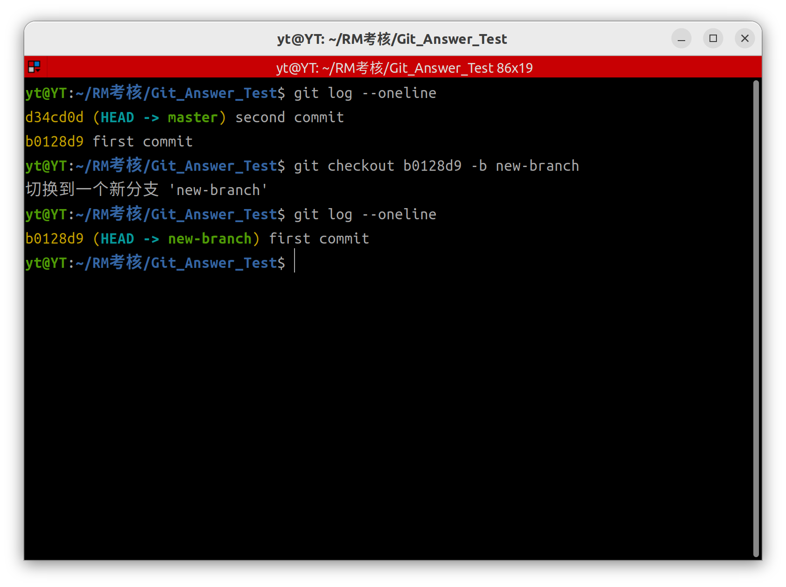
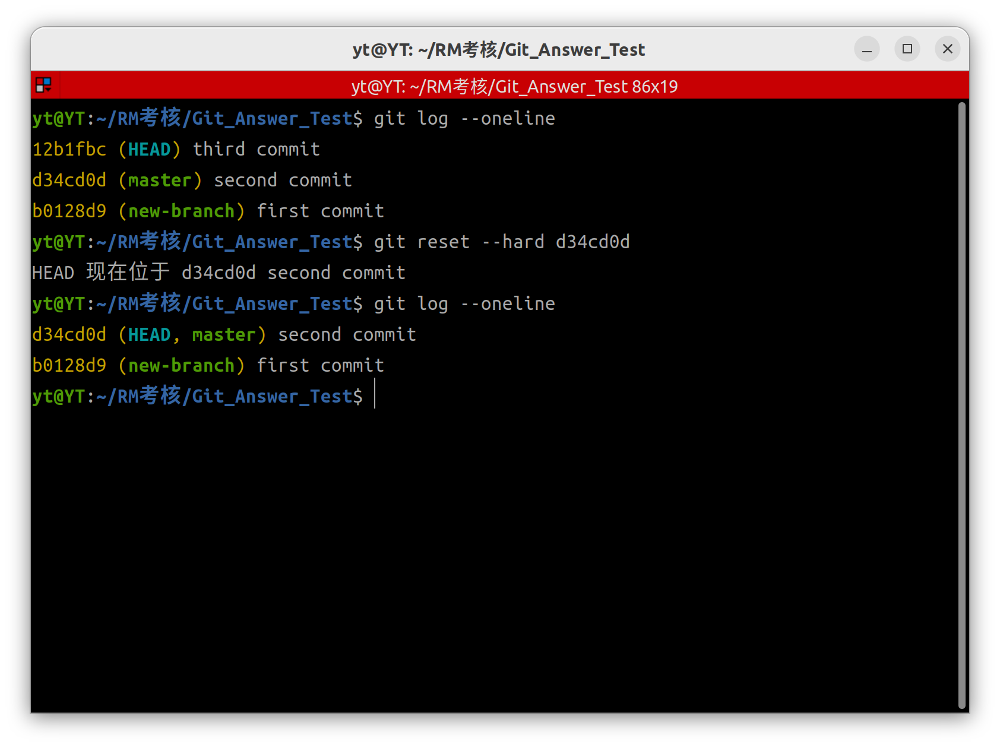
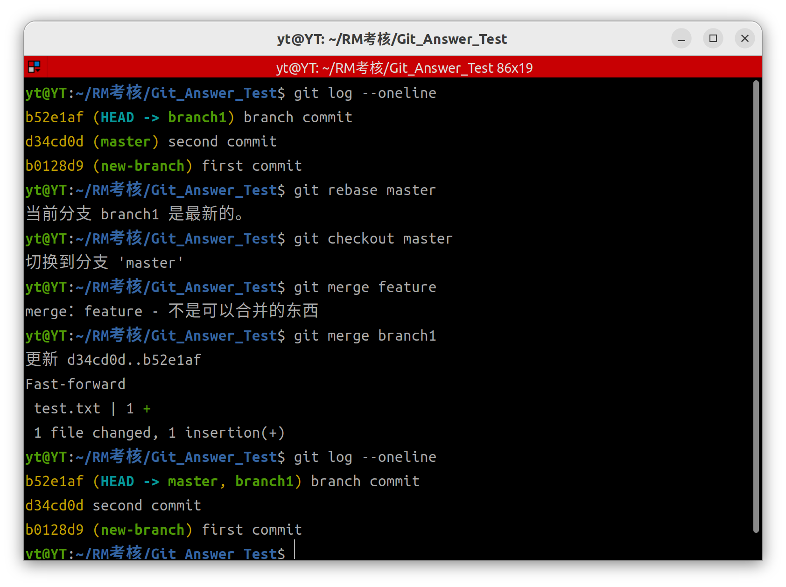
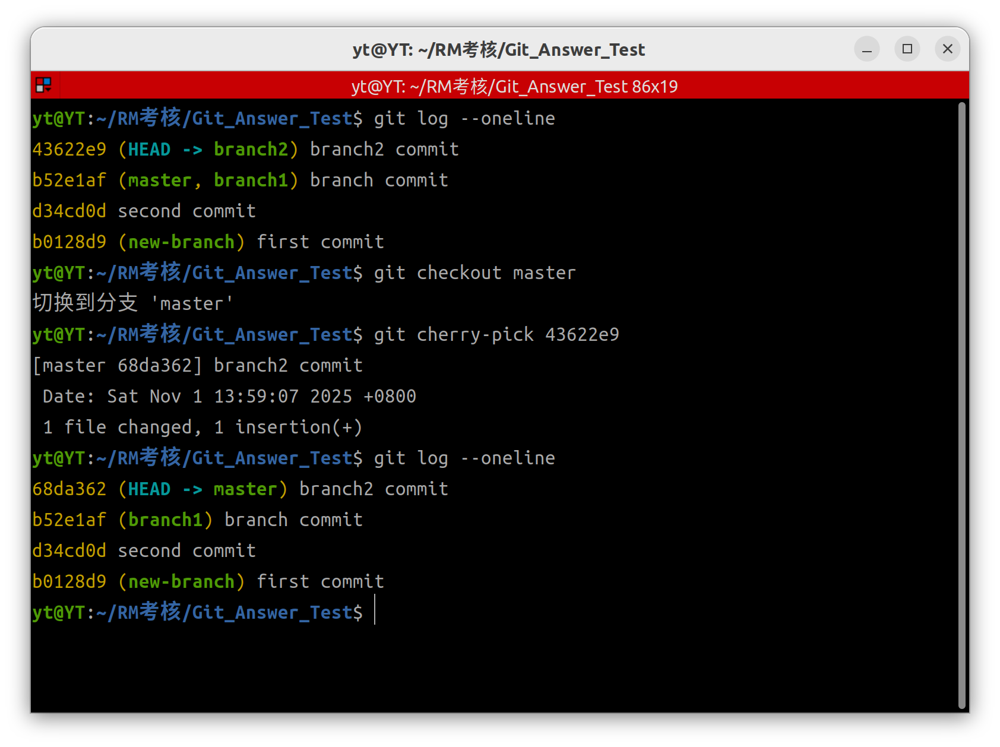

Git 命令操作解答
#一、回退暂存区和工作区的修改（恢复到最后一次提交状态）
##方式 1:分步骤回退

##方式 2：直接强制重置

#二、回退已提交的版本
##不修改历史的方式（适合公共分支）

###方式 1：使用 revert 创建抵消提交

###方式 2：基于旧版本创建新分支

##修改历史的方式（仅适合私有分支）

###方式 1：使用 reset 重置版本

###方式 2：交互式改写历史（rebase -i）

#三、除 merge 外的合并分支方式
##方式 1：变基合并（rebase）

##方式 2：选择性合并（cherry-pick）

