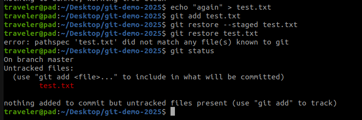
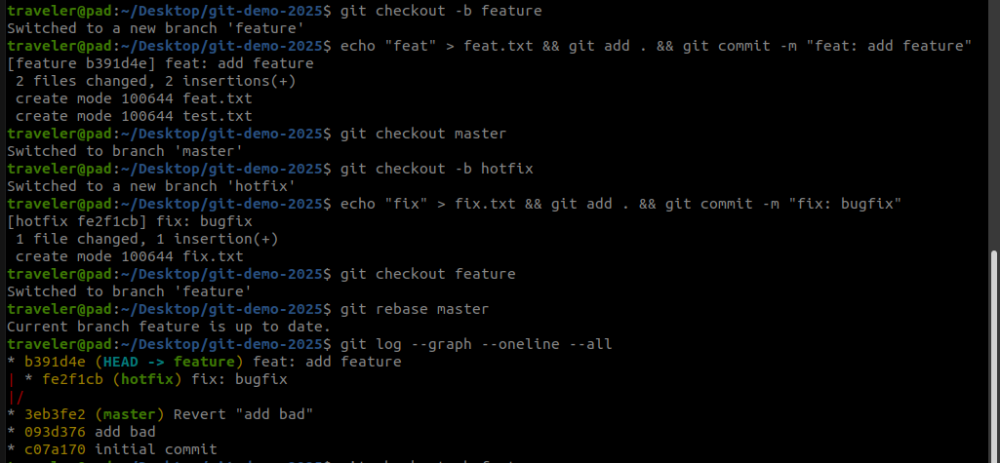

# Git 应用答案
### 题1
- `git reset HEAD file` + `git checkout -- file`  
- `git restore --staged file` + `git restore file`  
  

### 题2（不改/改历史）
- 不改历史：`git revert HEAD`  
- 改历史：`git reset --hard HEAD~1`  

### 题3（除 merge 外至少两种）
1. `git rebase` → 线性历史  
2. `git cherry-pick <commit>` → 单点合并  
3. `git merge --squash`  
  

