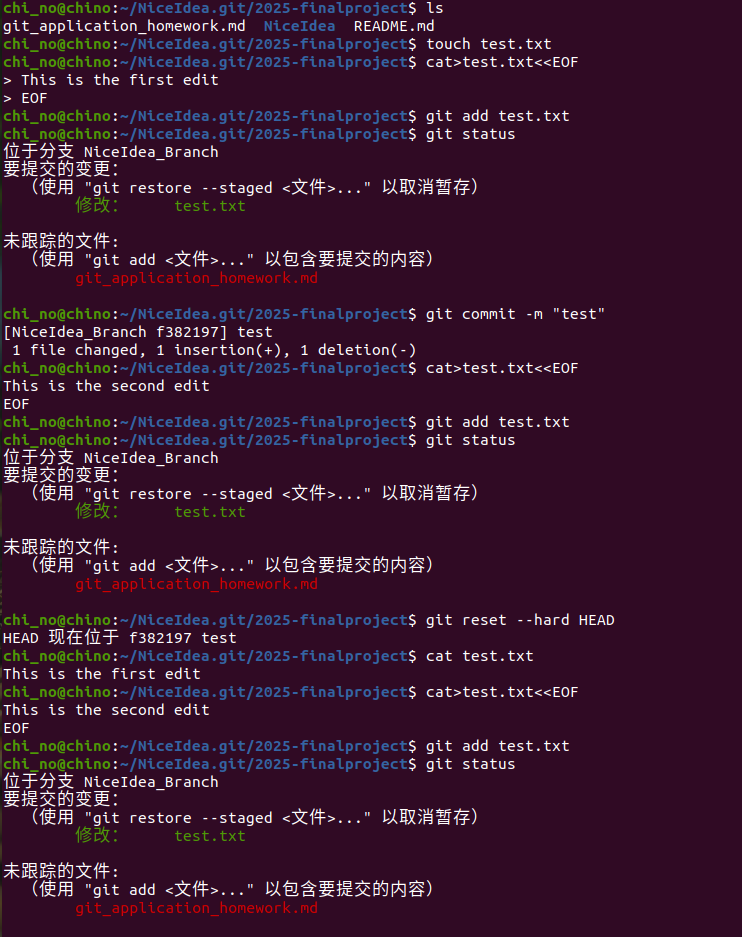
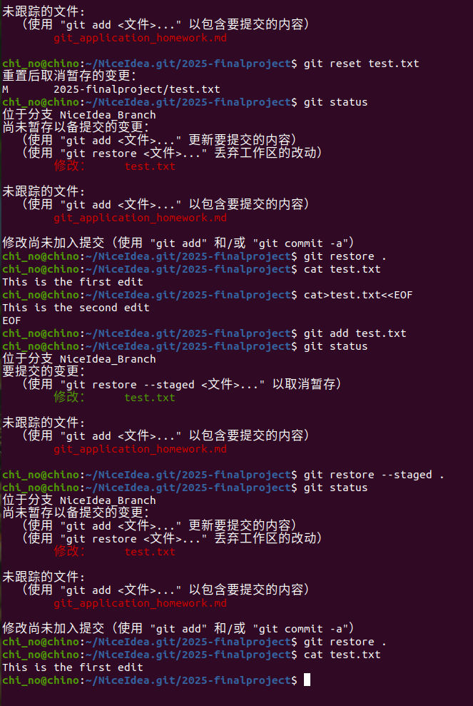
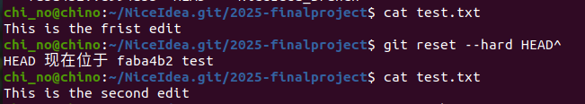
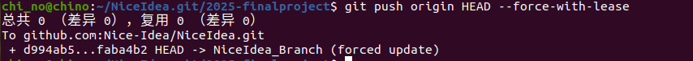
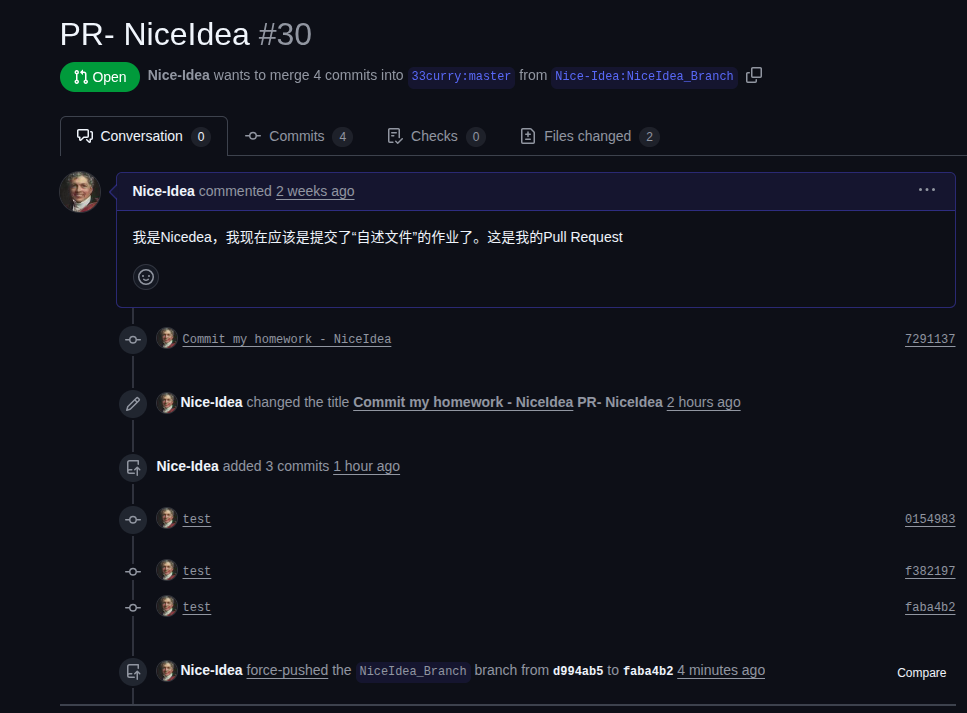
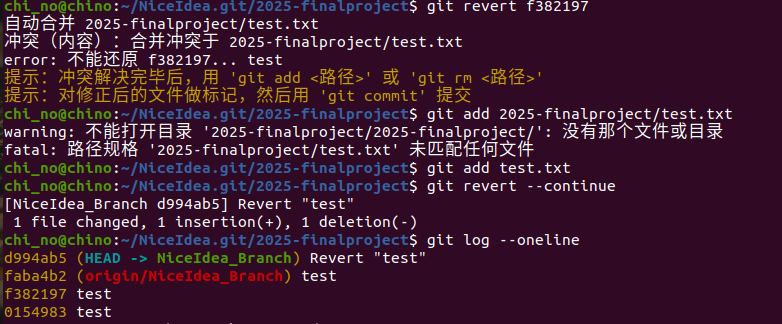
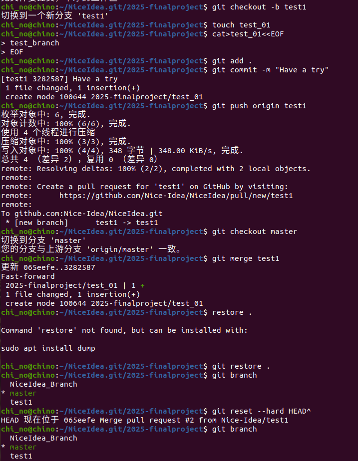
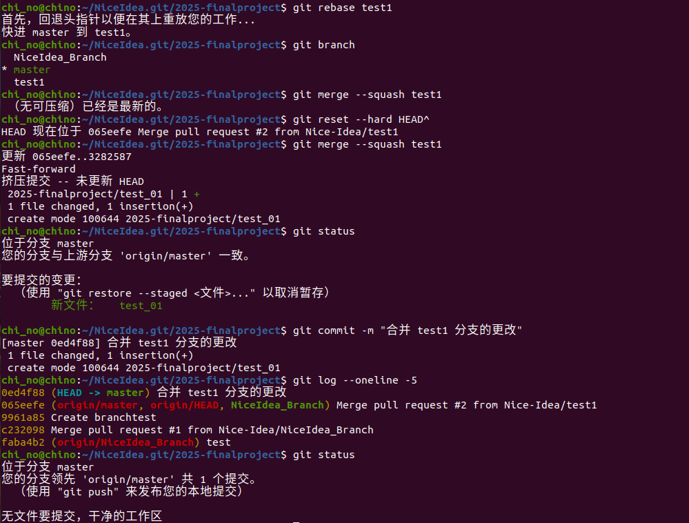
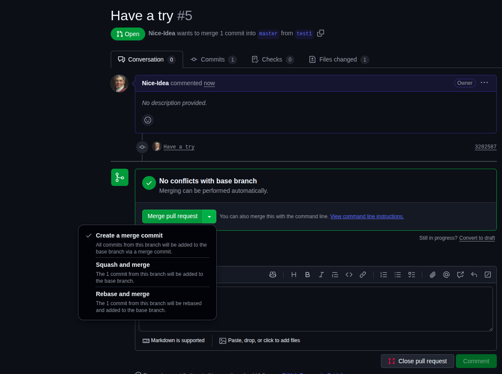

# Git_Appcaliton
## 1、
### 若你已经修改了部分文件、并且将其中的一部分加入了暂存区，应该如何回退这些修改，恢复到修改前最后一次提交的状态？给出至少两种不同的方式

例如文件为 test.txt
- 1.`git reset --hard HEAD` 硬回退
.
- 2.`git reset test.txt`
`git restore .` 分步回退
.
- 3.`git restore --staged .`
`git restore .` 现代命令
`--staged` 表示操作对象是暂存区。

## 2、
### 若你已经提交了一个新版本，需要回退该版本，应该如何操作？分别给出不修改历史或修改历史的至少两种不同的方式

例如文件为 test.txt
- 1.`git reset --hard HEAD^`
`git push origin main --force-with-lease` 修改历史,强制推送
.
- 2.`git log --oneline` 找到你想回退的那个版本的哈希值
`git revert f382197` 回退，会遇到冲突，需修改冲突的文件
`git add test.txt`
`git revert --continue`

## 3、
### 我们已经知道了合并分支可以使用 merge，但这不是唯一的方法，给出至少两种不同的合并分支的方式

例如分支为 test1
- 1.`git checkout master`切换到分支 'master'
`git merge test1`
.
- 2.`git rebase test1`变基
.
- 3.`git merge --squash test1`压合合并

- 4.在GitHub Pull Request界面操作

### 合并完成后需 commit 和 push

>之前一直忙着看ros教程，记错了以为ddl是10月17号，所以这么晚交，抱歉。

