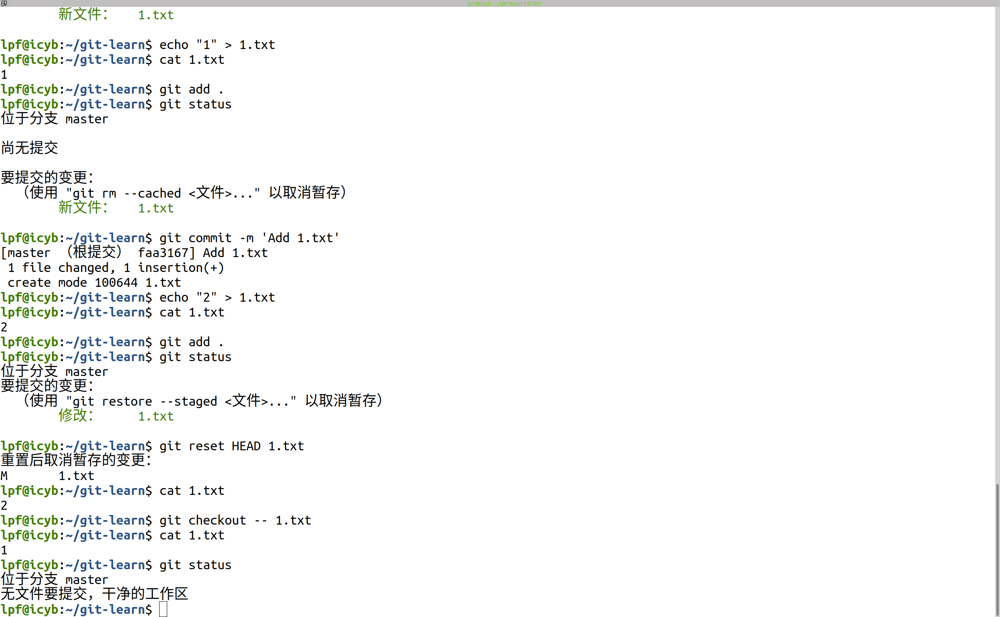
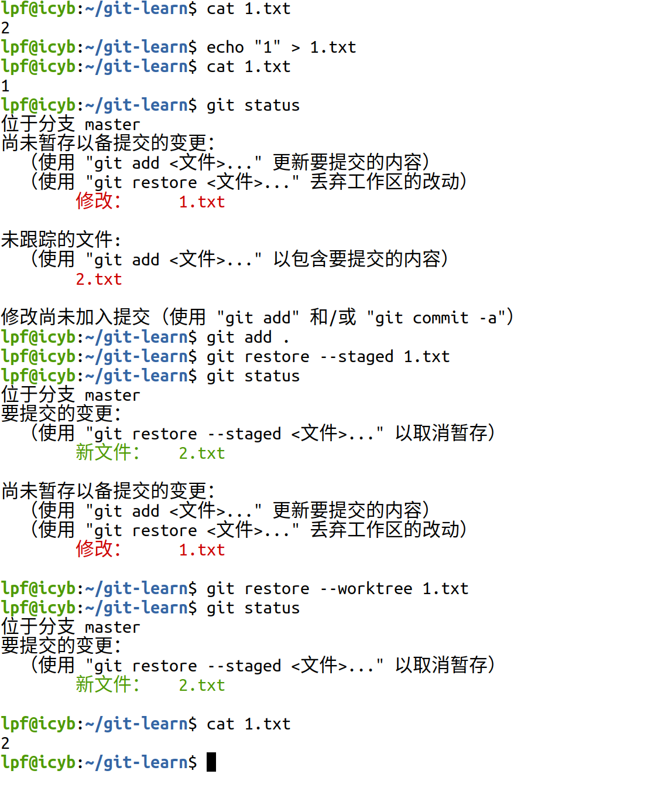
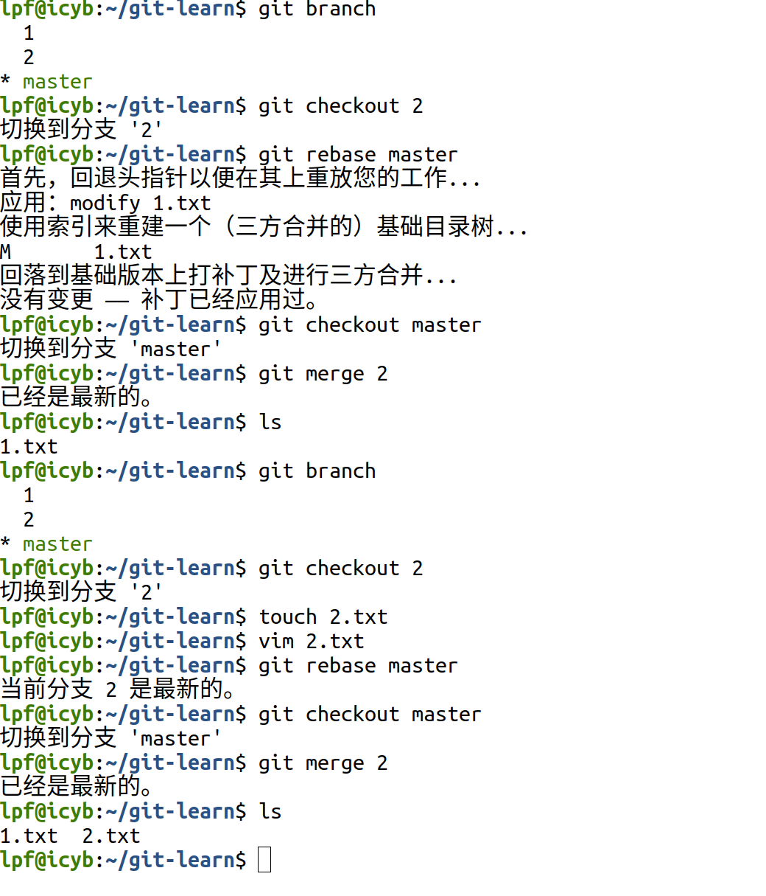

1.第一个问题学习回退暂存区的方法有reset 和reset --hard和restore。

——————————————————————————————————————————————————————————————————————————————————————————————————————————————————————

——————————————————————————————————————————————————————————————————————————————————————————————————————————————————————

——————————————————————————————————————————————————————————————————————————————————————————————————————————————————————

2.第二个问题若你已经修改了部分文件、并且将其中的一部分加入了暂存区，应该如何回退这些修改，恢复到修改前最后一次提交的状态的方法不修改历史的revert和reset --soft两种方法和修改历史的reset --hard和rebase -i

——————————————————————————————————————————————————————————————————————————————————————————————————————————————————————
.png)

——————————————————————————————————————————————————————————————————————————————————————————————————————————————————————

.png)

——————————————————————————————————————————————————————————————————————————————————————————————————————————————————————

.png)

——————————————————————————————————————————————————————————————————————————————————————————————————————————————————————

.png)

——————————————————————————————————————————————————————————————————————————————————————————————————————————————————————

3.第三个问题用了两种方法是rebase再merge的合并方法和cherry-pick提交的方法。

——————————————————————————————————————————————————————————————————————————————————————————————————————————————————————

——————————————————————————————————————————————————————————————————————————————————————————————————————————————————————

![git question3第二种cherry 命令执行截图] (./image/3.2.png)

——————————————————————————————————————————————————————————————————————————————————————————————————————————————————————

