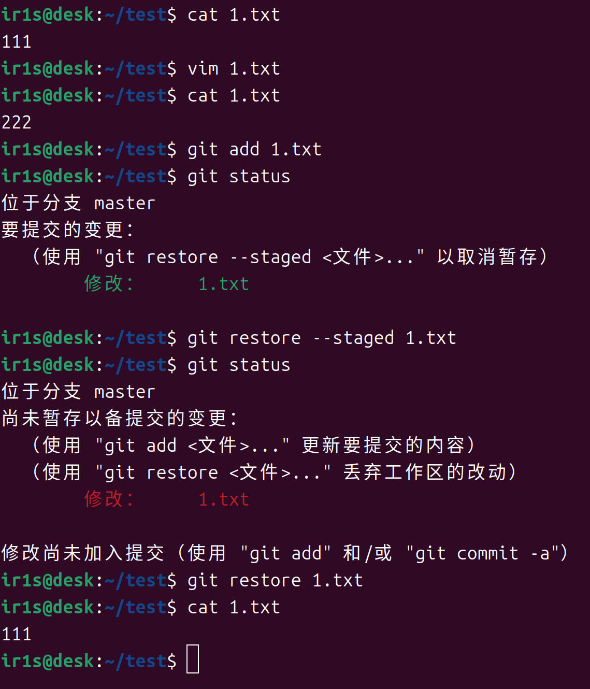
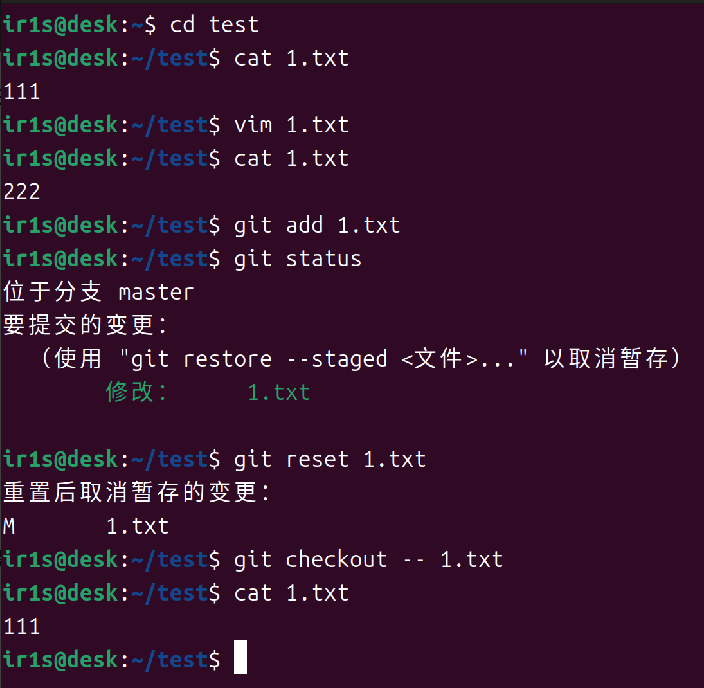
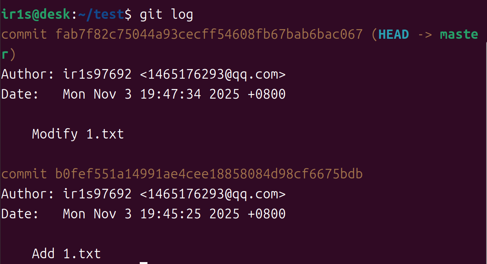
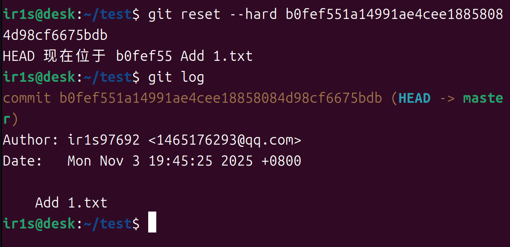
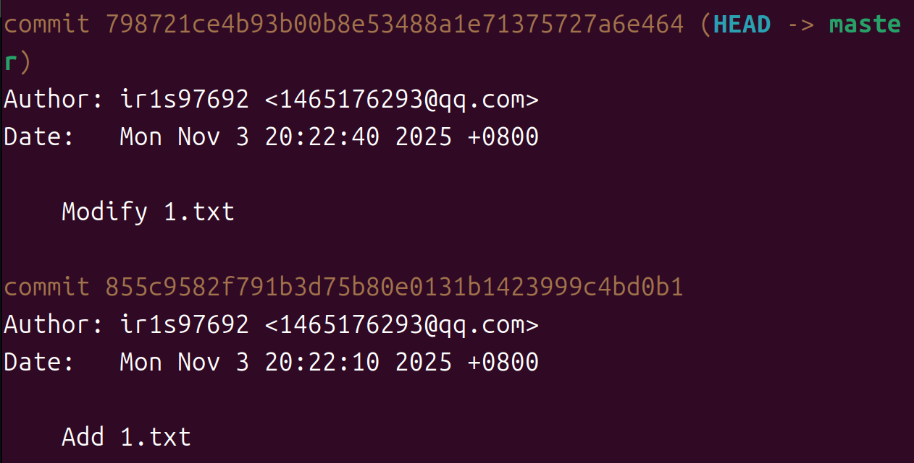
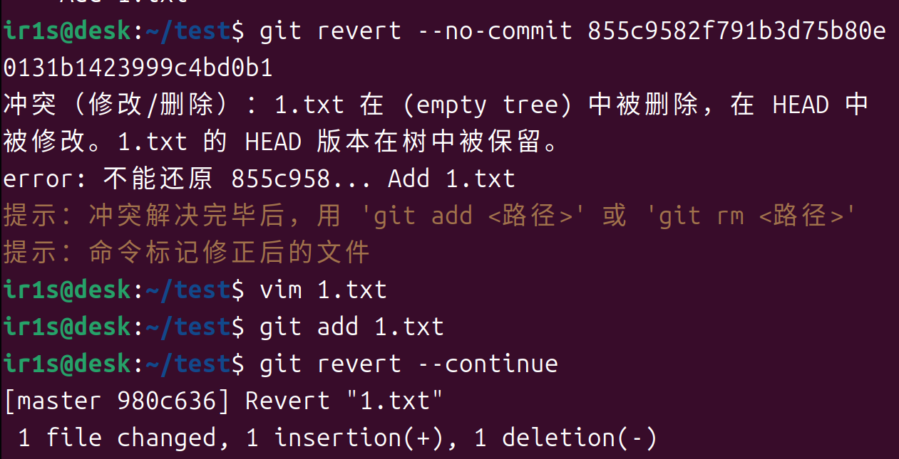
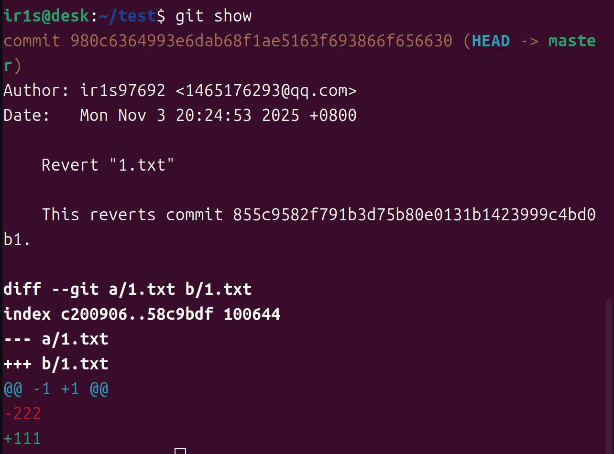
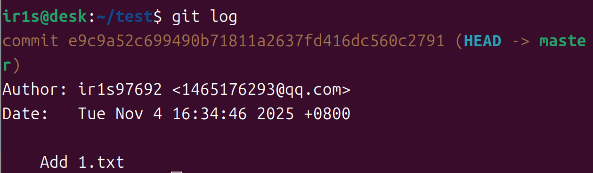
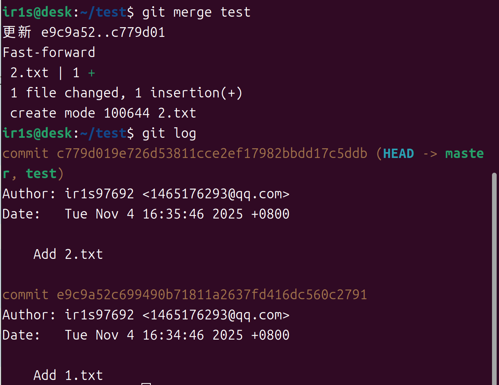
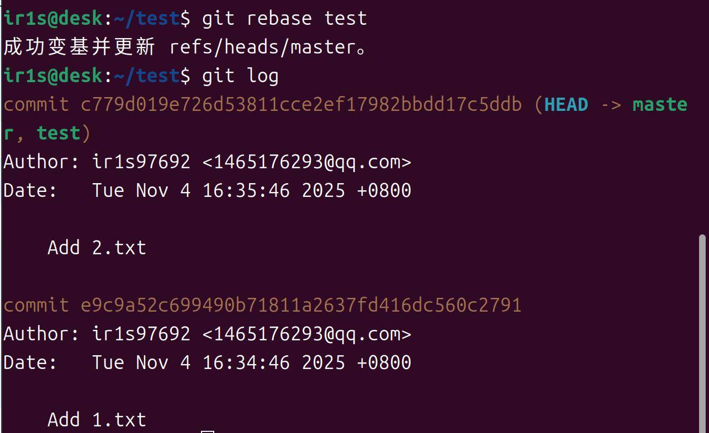

# 问题1

###### *若你已经修改了部分文件、并且将其中的一部分加入了暂存区，应该如何回退这些修改，恢复到修改前最后一次提交的状态？给出至少两种不同的方式*

#### 方法1：***restore***命令

1. 使用`git restore --staged <file>`  将暂存区中的文件移除，此时工作区中的修改将保留
2.  使用`git restore <file>` 将工作区中的修改复原到上次提交的状态

#### 实践

#### 方法2：***reset***命令

1. 使用`git reset [--mixed | --soft | --hard] <file>`  将暂存区移除，此时工作区的更改仍然保留
2. 使用`git checkout -- <file>`  将工作区指定文件恢复到最近一次提交的状态

#### 实践

# 问题2

###### *若你已经提交了一个新版本，需要回退该版本，应该如何操作？分别给出不修改历史或修改历史的至少两种不同的方式*

#### 修改历史的版本回退：***reset***

* 首先使用`git log`查看一下版本号

看到第一个版本的哈希值为b0fef5开头的那个

* 使用`git reset --hard [commit]`  回退版本

这样就成功将版本回退，但后面的commit记录都会消失

#### 保留历史的版本回退：***revert***

* 同样先用`git log` 看一下版本号

* 使用`git revert --no-commit [commit]` 将版本回退

这里发生了冲突，手动修改冲突后使用`git add <file>` 标记冲突文件

最后使用`git revert --contiune` 完成回退

* 使用了`git show` 查看当前状况

revert会生成一个新的提交反向操作旧版本的提交，保留了旧的commit记录

# 问题3

###### *我们已经知道了合并分支可以使用 merge，但这不是唯一的方法，给出至少两种不同的合并分支的方式*

#### 方式1：*merge*

* 先使用`git checkout <branchname>`  切换到希望合并到的目标分支

目前master分支的状况

* 现在可以通过`git merge <branchname>` 将其他分支合并到当前分支

下图将test分支合并到了master分支

* merge会创建一个新的提交，保留两个分支的所有历史记录

#### 方式2：*rebase*

* 同样进入到要合并的目标分支
* 使用`git rebase <branchname>`  将其他分支合并到当前分支

下图将test分支合并到了master分支

* rebase将一个分支的提交移植到另一个分支上，使提交历史记录是线性的，有利于保持提交历史记录的整洁

