# Git_Learn

[TOC]

---

## 安装Git

```bash
sudo apt-get install git
```

安装完后在终端中运行 ` git --version `验证

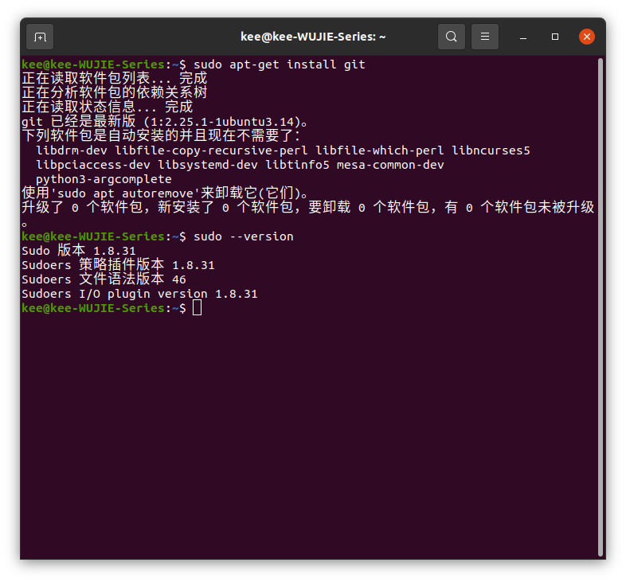

## 初始化

初始化设置用户名和邮箱

```bash
git config --global user.name "Your Name"	# "Your Name"中写用户名
git config --global user.email email@mail.com # email@mail.com写你GitHub的邮箱
git config --global credential.helper store	#保存邮箱和用户名

```

查看Git的配置信息

```bash
git config --global --list
```

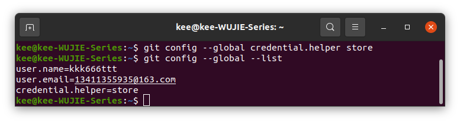

## 新建版本库（仓库）

英文名： `Repository`简称 `Repo` 

可以理解成一个**目录**

这个目录里的所有文件都可以被Git管理起来

每个文件的*修改、删除、添加等操作*，Git都能跟踪到，以便任何时候都可以**追踪历史**或者**还原到之前的某一个版本**

### 创建仓库

把一个目录变成Git可以管理的仓库即可

#### 方式一：git init

**在自己电脑本地直接创建一个仓库**

- [ ] 在一个合适的位置创建一个新目录

```bash
cd ~
mkdir learn-git #创建目录
cd learn-git #进入目录
git init #创建仓库
#一般初始化后是在main/master(分支名称)分支下,表示当前这个目录已经是一个被git管理的仓库
```


下面看一下这个目录 `learn-git` 下有没有叫 `.git` 的目录

```bash
cd learn-git 
ls	#查看是否有 .git 目录，一般直接 ls 看不到，因为是一个隐藏的目录
ls -a #用此方式显示所有文件，包括隐藏目录
```

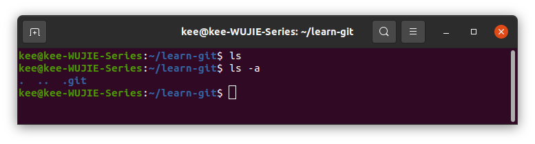

这样就说明成功创建Git目录


- [ ] 当然，也可以指定一个目录为Git仓库

```bash
cd ~
git init 'filename' #'filename' ->目录
```


---

下面内容可以忽略(含Git仓库转换为普通目录)

进入 `.git`目录看一下

```bash
cd .git
ls -altr
```

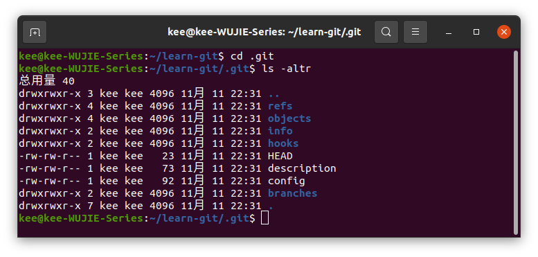

这些文件和目录都是Git仓库的重要组成部分，不能随意删除或者修改其中内容，否则会破坏Git仓库，因此需要在 `git` 前加一个 `.`把其隐藏

删除 `git`目录

```bash
cd learn-git
\rm -rf .git #表示当前目录不再是一个Git仓库，而就是一个普通的目录了
```

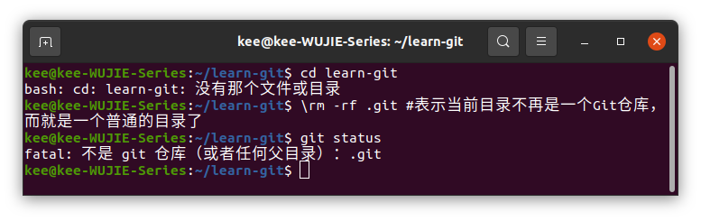

为了连接后续内容，这里用 `git init`的另一种用法创建个新文件

```bash
cd learn-git
git init my-repo
```

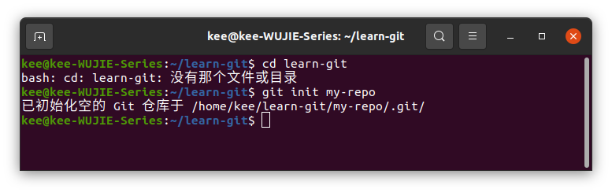

这一步后`learn-git`不再是一个Git仓库，仅有 `my-repo`是Git仓库

可以通过 `git status`查看

```bash
cd learn-git/my-repo
git status
```

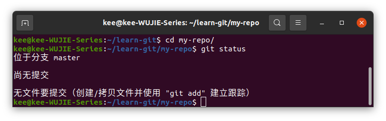


----


#### 方式二：git clone

**从远程服务器(如GitHub)上克隆一个已经存在的仓库**

在后面详细讲解，至此先简单了解即可

# 此处拉一个超链接(Git Clone)

从GitHub上clone

```bash
cd ~
git clone '仓库地址'	#一般仓库地址有html的和ssh的，在GitHub上复制即可
#最好用手机热点连接，校园网不好使
```


----


## Git工作区域和文件状态

### git的本地管理分为三个区域

| 工作区                                                       | 暂存区                                                       | 本地仓库                                                     |
| ------------------------------------------------------------ | ------------------------------------------------------------ | ------------------------------------------------------------ |
| Working Directory                                            | Staging Area/Index                                           | Local Repository                                             |
| 也叫工作目录或者本地目录，就是我们自己电脑上的目录(在资源管理器里面能够看到的文件夹就是工作区) | 是一种临时存储区域，用于保存即将提交到Git仓库的修改内容，暂存区域是在Git进行版本控制时非常重要的一个区域 | 本地仓库就是通过git init 命令创建的那个仓库，他包含了完整的项目历史和元数据，是Git存储代码和版本信息的主要位置 |

简单来说：

工作区 (`.git`所在的目录)就是我们实际操作的目录

暂存区(`.git/index`)就是一个中间区域，用于临时存放即将提交的修改内容

本地仓库(`.git/objects`)是Git存储代码和版本信息的主要位置

！

修改完工作区间的文件(`git add`)-->将他们添加到暂存区(`git commit`)--->本地仓库

！

此过程中我们可以使用Git提供的命令来**查看、比较或者撤销修改**，来保证版本控制的准确性和完成性

但是，如果我们每次文件修改之后都需要进行一次提交的话会比较麻烦，所以Git提供了一种方式，也即可以将**修改的文件**先**添加到暂存区**中，然后在把所有暂存区中的文件统一执行一下提交操作

### Git中的文件存在几种状态

| 未跟踪                              | 未修改                                                       | 已修改                                 | 已暂存                                     |
| ----------------------------------- | ------------------------------------------------------------ | -------------------------------------- | ------------------------------------------ |
| Untrack                             | Unmodified                                                   | Modified                               | Staged                                     |
| 新创建的，还没有被Git管理起来的文件 | 已经被Git管理起来的文件，但是文件内容没有发生变化，还没有被修改过 | 修改了文件，但是还没有添加到暂存区里面 | 修改之后，并且已经添加到了暂存区域内的文件 |

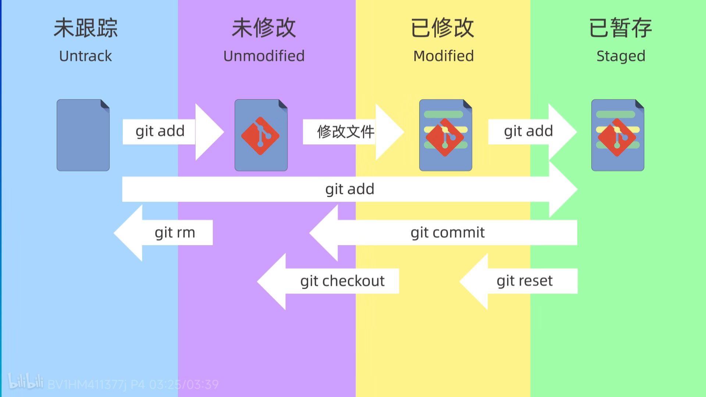


---


## 添加和提交文件

上面已经学习了

| git init   | 创建仓库       |
| ---------- | -------------- |
| git status | 查看仓库的状态 |
| git add    | 添加到暂存区   |
| git commit | 提交           |

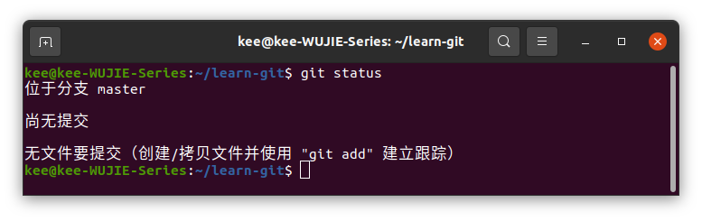

**以上图片改一下，应该是 `~/learn-git/my-repo`作为仓库**

现在还没执行任何提交操作

---

### 创建文件

可以使用 `vim`或者 `vscode`

```bash
cd learn-git/my-repo
echo "这是第一个文件" > file1.txt
ls
cat file1.txt
```

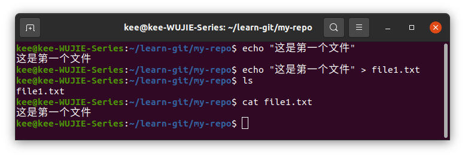

查看下仓库状态

```bash
cd learn-git/my-repo
git status
```

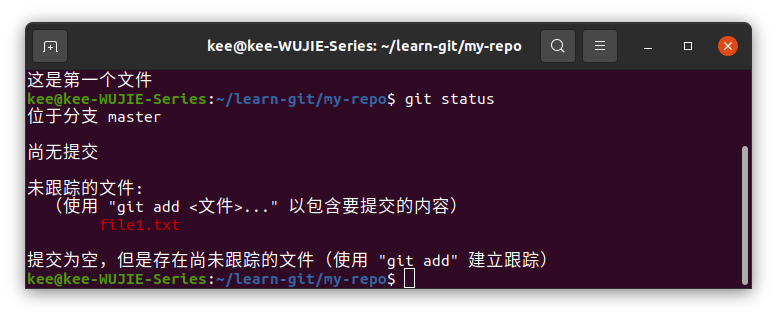

可见此文件正处于一个未被跟踪的状态

---

### 添加到暂存区

使用 `git add`将文件添加到暂存区

```bash
cd learn-git/my-repo
git add file1.txt
git status	#查看状态
```

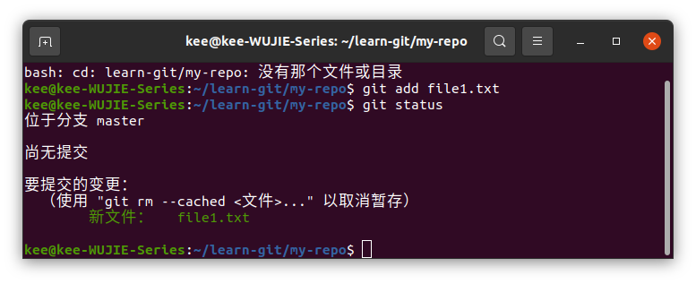

括号中的提示

```bash
git rm --cached <file>...	#取消暂存
git status	#查看状态
```

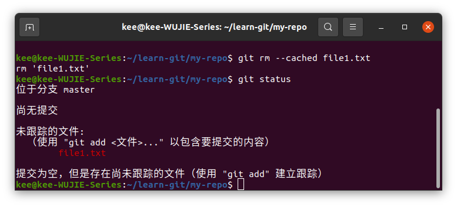

可见将 `file1.txt`取消暂存了

**重新把 `file1.txt`提交到暂存区**

---

### 将文件提交到仓库

使用 `git commit`将文件从暂存区提交到本地仓库

`git commit`只会将**暂存区**的文件提交，而不会提交**工作区**的文件

比如

```bash
cd learn-git/my-repo
echo "这是文件2的内容" > file2.txt	 #创建一个新的文件，并且写入东西(不要复制注释)
git status	#查看仓库状态
```

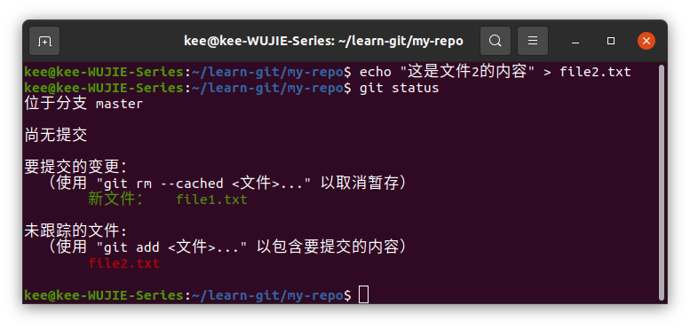

可见 `file2.txt`是未跟踪状态

好，为了验证工作区的文件是否会被 `git commit`到本地仓库

```bash
cd learn-git/my-repo
git commit -m "要提交的信息"	
#需要使用 -m “msgs” 这个信息会被记录到仓库中
#如果不指定 -m 这个参数，那么 git commit 命令会进入一个交互式的界面
#默认使用vim来编辑提交信息
```

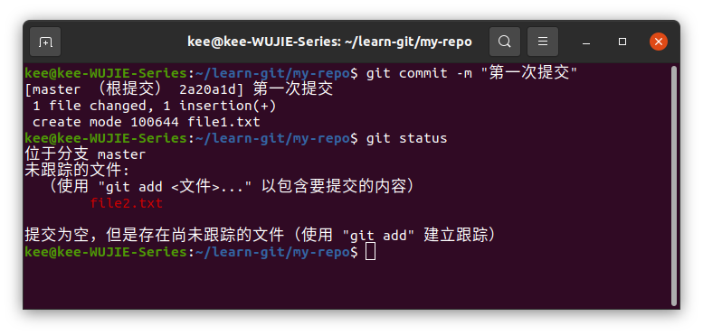

可见 `file1.txt`被提交到本地仓库了，而 `file2.txt`还在工作区中未被提交

----

### git add命令多样

#### git add命令的通配符 *.

```bash
cd learn-git/my-repo
echo "file3" > file3.txt
echo "file4" > file4.txt
#再添加一个不是以 .txt 结尾的文件
echo "file5" > file5.sh
#查看仓库
ls
```

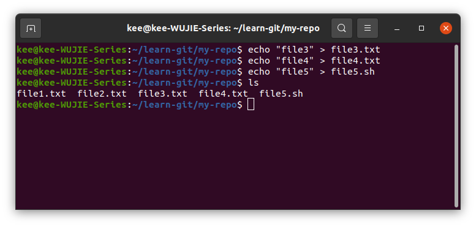

在看下状态

```bash
git status
```

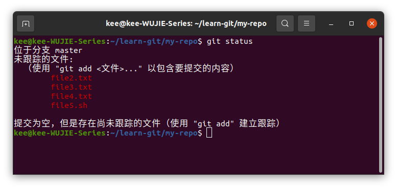

可见除了 `file1.txt`被仓库保管起来了，其他文件都处于一个未跟踪的状态


可以使用

```bash
#将所有以 .txt结尾的文件添加到暂存区
git add *.txt
git status
```


把所有以 `.txt`文件都提交至暂存区，而 `.sh`文件并没有

#### git add命令接受文件夹作参数

```bash
#将所在文件夹的所有文件全部添加到暂存区
git add .
```

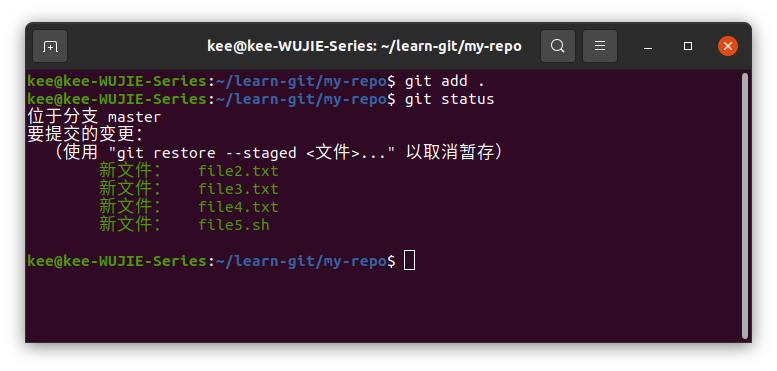

好，现在将暂存区文件提交至本地仓库

```bash
#这次直接commit
git commit
```

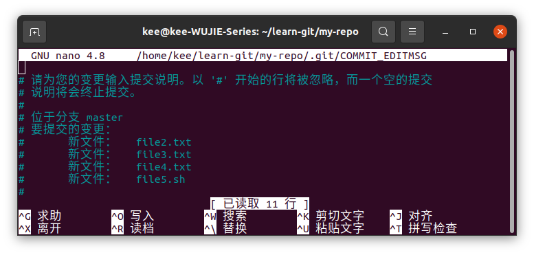

默认vim，此处nano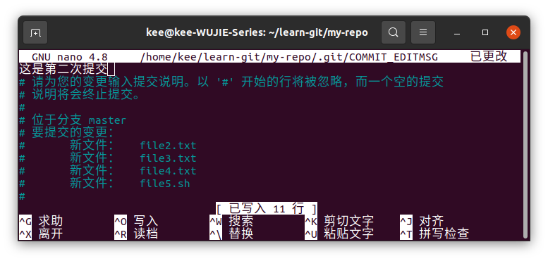

保存后退出，查看状态

```bash
git status
```

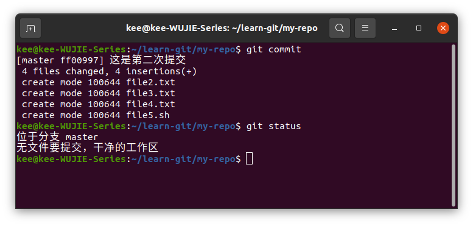

### git log查看日志

现在仓库中有两次提交，用 `git log`查看日志

```bash
git log
```

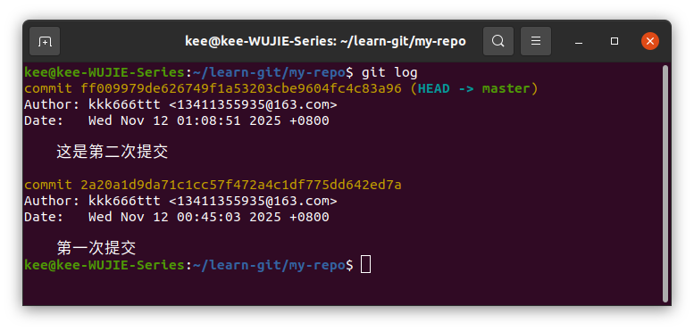

`commit`后面那一串16进制的字符串是每次提交的唯一的ID

`Author`就是账户 账户名+邮箱

`Date`提交日期

当然，`git log`还可以接上一些参数

比如

```bash
git log --oneline
```

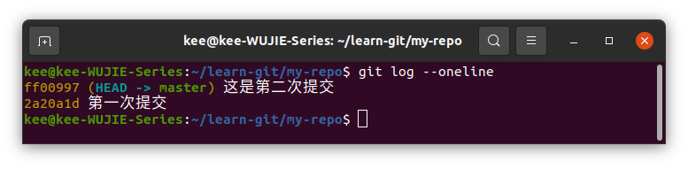

这样就只会显示每次提交的ID和提交的信息msgs了！

---

## git reset回退版本

在日常开发中，经常会需要撤销之前的一些修改内容，或者回退到之前的某一个版本，此时就需要用到 `git reset`这个命令，用于回退版本，**可以退回到之前的某一个提交的状态**

有三种用法：

| git reset --soft  | soft参数表示回退到某一个版本，并且保留工作区和暂存区的所有修改内容 |
| ----------------- | ------------------------------------------------------------ |
| git reset --hard  | hard参数表示回退到某一个版本，并且丢弃工作区和暂存区的所有修改内容 |
| git reset --mixed | mixed参数介于soft和hard两个参数之间，表示回退到某一个版本，并且只保留工作区的修改内容，而丢弃暂存区的修改内容，mixed也是reset命令的默认参数 |

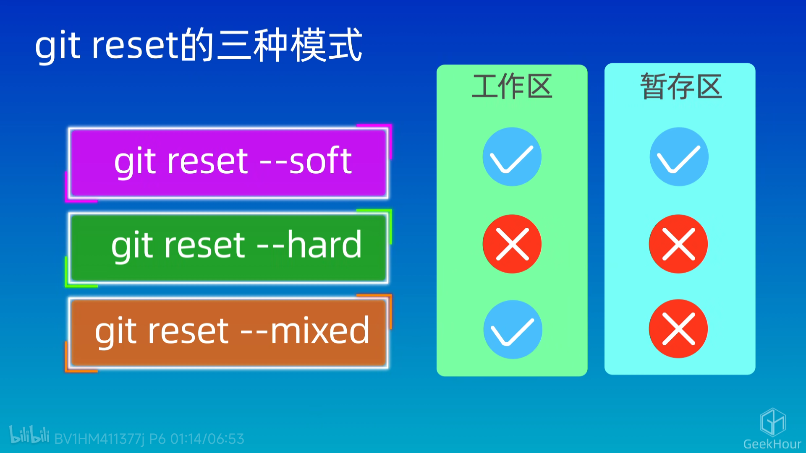

**需要根据不同的场景来选择使用不同的参数**

```bash
#下面看一个实际的例子
cd learn-git
git init repo
cd repo
echo 111 > file1.txt
echo 222 > file2.txt
echo 333 > file3.txt
git add file1.txt
git commit -m "commit1"
git add file2.txt
git commit -m "commit2"
git add file3.txt
git commit -m "commit3"
#如此，只有三次提交
git log --oneline
```

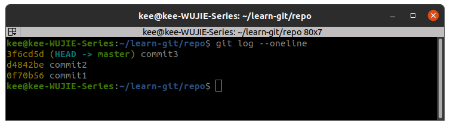

```bash
#下面新开一个终端
#把repo复制三份
cp -rf repo repo-soft
cp -rf repo repo-hard
cp -rf repo repo-mixed
#cp后的文件应该是已被commit到仓库了
```


---

### soft

```bash
cd repo-soft
git reset --soft d4842be	#后面接上要回退的版本ID
git log --oneline	#看下日志
```

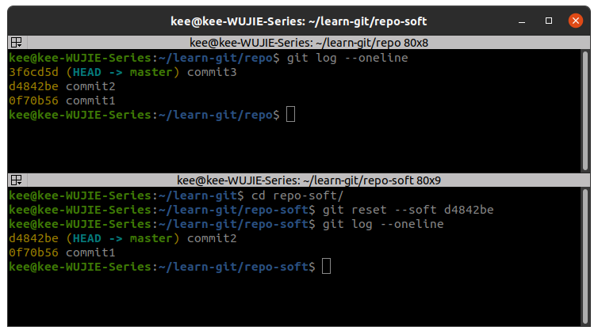

可见现在提交历史只有两次了，HEAD指针也指向了第二个版本

下面看一下**工作区**和**暂存区**的内容

```bash
cd repo-soft
ls
#查看下内容
cat file3.txt
#查看下工作区和暂存区被跟踪的文件
git ls-files
#查看暂存区的文件
git ls-files --stage
```

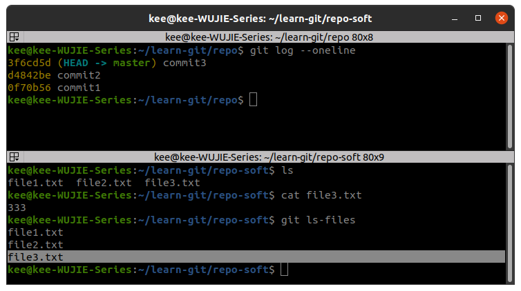

可见 `file3.txt`在暂存区

在看一下仓库状态

```bash
git status
```

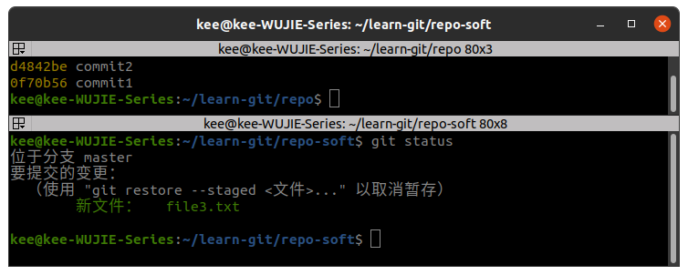

可见 `file3.txt`未被提交

也就是回到了 `commit2`，也即之前提交了 `file1.txt` 、`file2.txt`后的版本

这里我们用的是 `soft`参数，所以回退到上一个版本的时候，**工作区和暂存区**的内容都**不会被清空**，所有 `file3.txt`这个文件还是存在的，但是因为我们回退到了**上一个版本**，也就是**第二个版本**，而 `file3.txt`这个文件是在**第三个版本才添加的**。此时，我们就可以修改一下 `file3.txt`的内容,然后**重新添加**到**暂存区**和**提交到仓库**即可！

因此，**最好用soft!**

---

### hard

```bash
cd learn-git/repo-hard
git reset --hard HEAD^	#这里用 HEAD^ 来表示回退到上一个版本
git log --oneline	#查看下提交历史
```

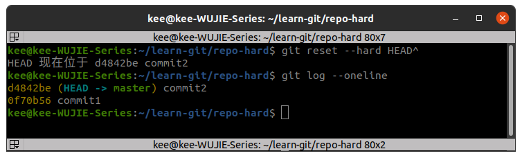

再看一下工作区和暂存区的内容

```bash
ls
```

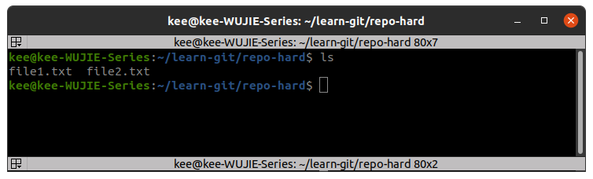

可见 `file3.txt`已经不存在了

看一下暂存区的内容

```bash
git ls-files --stage
```

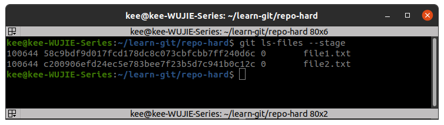

可见没有 `file3.txt`这个文件，即我们使用hard参数，回退到上一个版本的时候，**工作区**和**暂存区**的内容都会被清空！

### mixed

