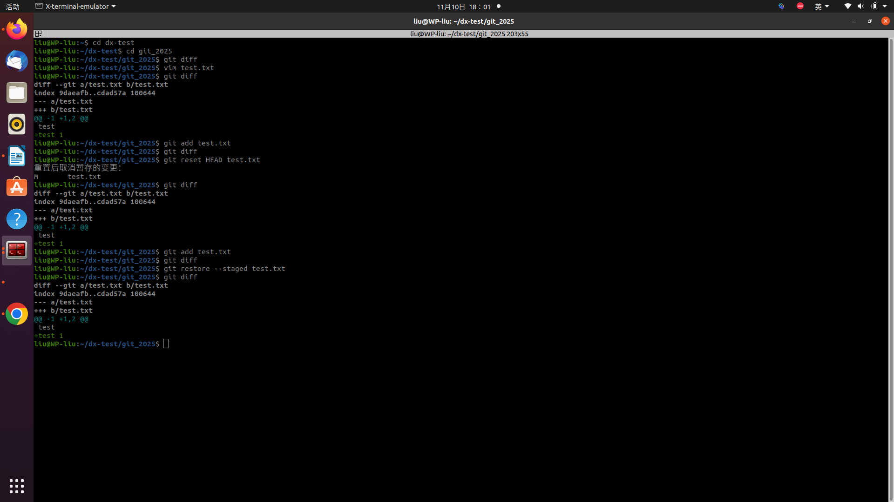
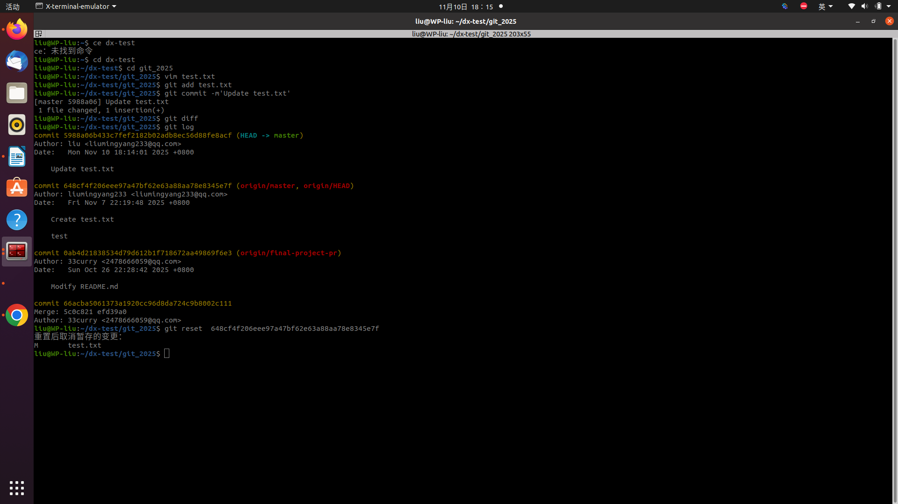
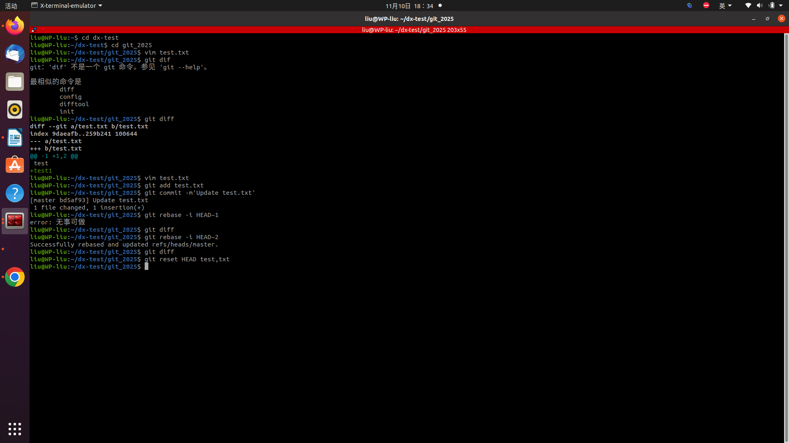
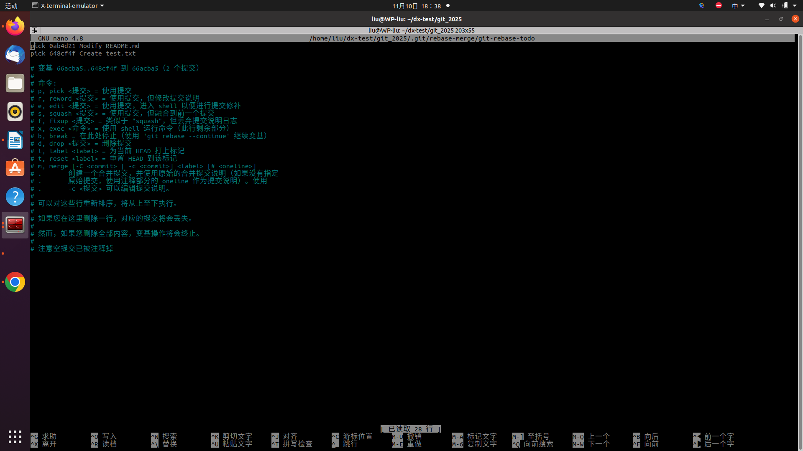
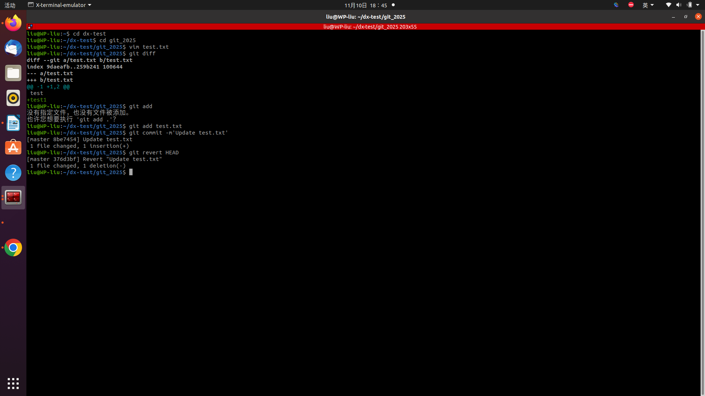

1. 回退暂存区的文件

方式一：git restore --staged 文件名
#可以回退暂存区指定的文件
方式二（旧版命令）：git reset HEAD 文件名
2. 回退版本

修改历史：
方式一：git reset 要回退到的版本的哈希值

#可以在reset后添加soft（只回退不删文件）或hard参数（回退并删除文件），回退本地仓库的版本
方式二（稍微麻烦一点）：
git rebase -i HEAD~

#要修改的操作是前第几次操作
然后进入到另一个页面，把要修改的那一行的pick改成drop然后ctrl+o保存，enter，再ctrl+x退出，这样子修改跟回退版本效果一样
 
不修改历史：
方式一：git revert HEAD

#撤销最近一次提交，不修改历史提交，其中HEAD可以替换成对应提交的哈希值来指定撤销哪一次，进入页面之后检查一下然后ctrl+o，再enter保存，ctrl+x退出
 
3. 合并分支（除了merge）

方式一：（先切换分支）git checkout 要合并到的分支
git rebase 要合并过去的分支
前提是两者没有冲突
 
方式二：（合并分支的一部分）
（先切到要合并到的分支）git checkout 要合并到的分支
（查看那个分支的提交ID）git log 有要合并过去部分的那个分支
git cherry-pick 要合并过去的提交的ID
 