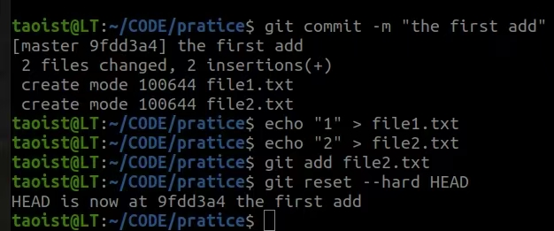
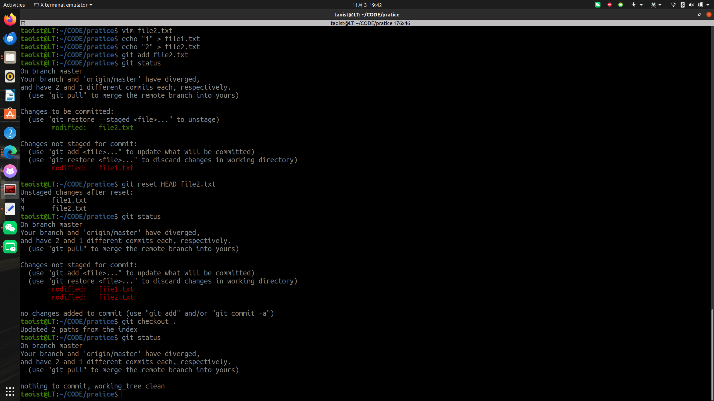
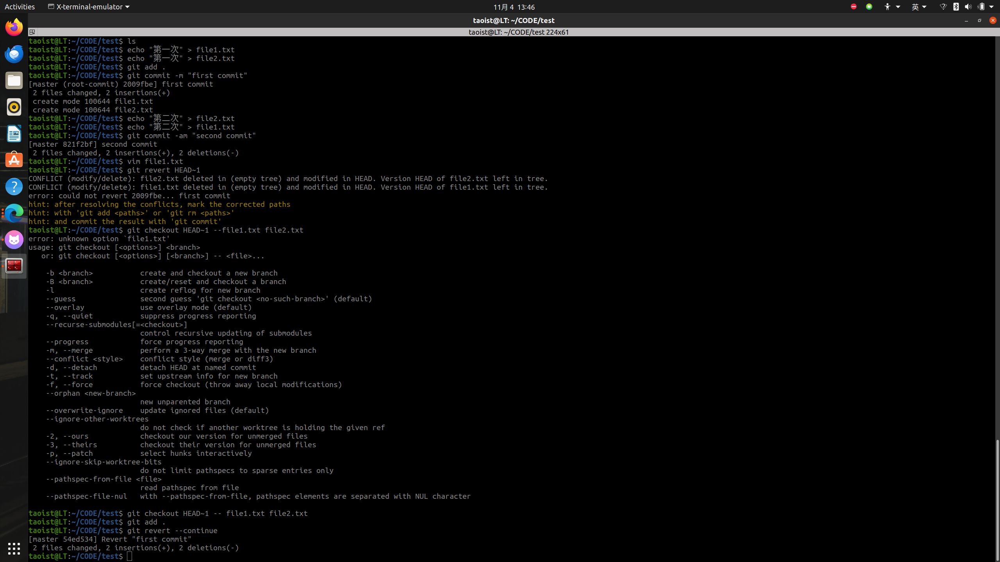
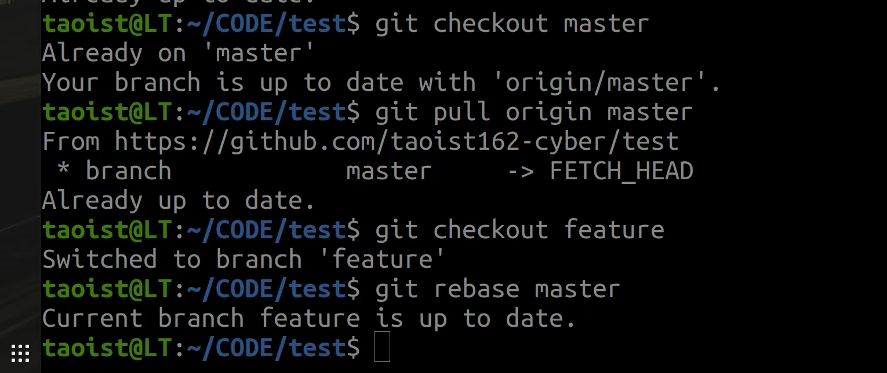
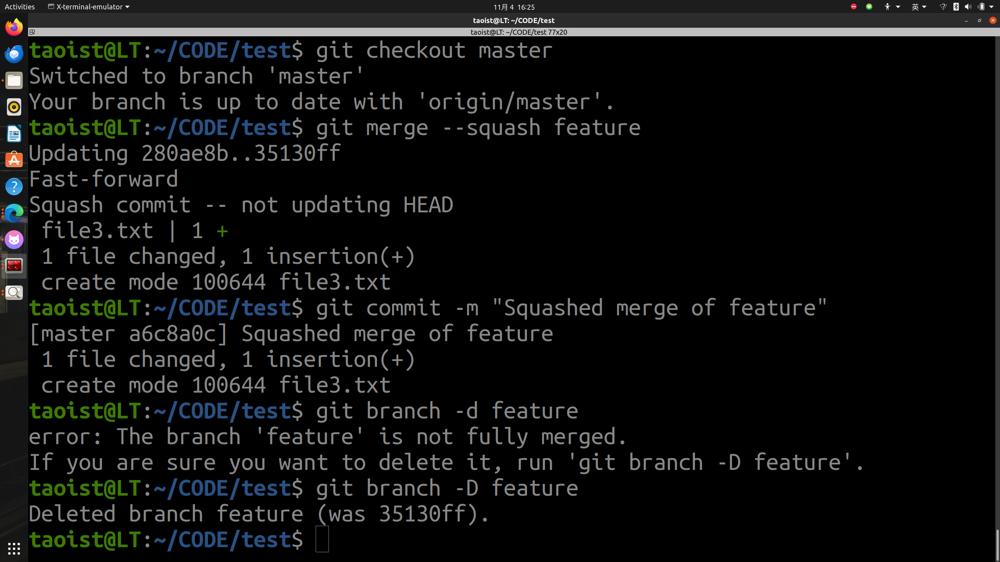

#Git Application
==要求： 编写一个文档，回答下列问题，这些问题的答案都应当使用 git 命令实现
提交： 一个 MarkDown 文件和若干个图片文件，在 MarkDown 中使用有效的相对路径引用你的图片==

1. **若你已经修改了部分文件、并且将其中的一部分加入了暂存区，应该如何回退这些修改，恢复到修改前最后一次提交的状态？给出至少两种不同的方式**
- 方法一：使用 git restore
直接git reset --hard HEAD

- 方法二：使用 git checkout 或 git reset（经典方式，兼容旧版本）
假设file1.txt是修改的文件中尚未加入到暂存区的文件，file2.txt是已经加入到暂存区的文件，先git reset HEAD file2.txt,再git checkout .

2. **若你已经提交了一个新版本，需要回退该版本，应该如何操作？分别给出不修改历史或修改历史的至少两种不同的方式**
- 不修改历史：
1. 方法一：使用 git revert（标准方式）
git revert HEAD~1,之后git checkout HEAD~1 -- < file >,然后git add < file >,然后就是git revert --continue,最后可以用git status检查一下,这样就可以回退至上一个版本了。

2. 方法二：使用 git revert --no-commit + 手动 commit（更灵活）
首先git revert --no-commit < commit-hash >,然后git checkout HEAD~1 -- < file >,之后git add .和git -m "Revert commit < commit-hash >"

- 修改历史：
1. 方法一：使用 git reset --hard（删除提交）
使用git reset --hard< commit-hash >,如果已推送:git push --force-with-lease origin < branch >

2. 方法二：使用git rebase -i(交互式重base,编辑历史)
使用git rebase -i HEAD~2,然后在编辑器中，将要删除的版本面前的pick改写为drop或删除该行,之后保存退出，git会重写历史（如果已经推送，同样需要force push）。

3. **我们已经知道了合并分支可以使用 merge，但这不是唯一的方法，给出至少两种不同的合并分支的方式**
- 方法一：使用git rebase(重放提交，实现线性合并)
先切换到目标分支:git checkout master,然后更新master: git pull origin master,之后git checkout feature,接着git rebase master。

- 方法二：使用git merge --squash(压缩合并)
首先先切换到main: git checkout master,压缩git merge --squash feature,然后提交git commit -m"Squashed merge of feature",最后git branch -d feature,失败则使用git branch -D feature强制删除分支。

