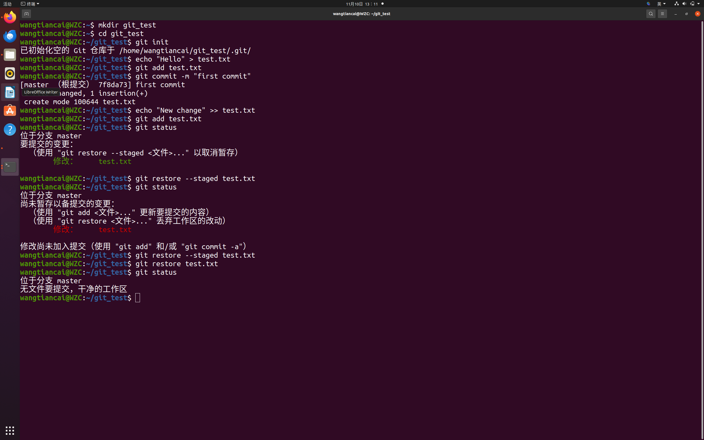
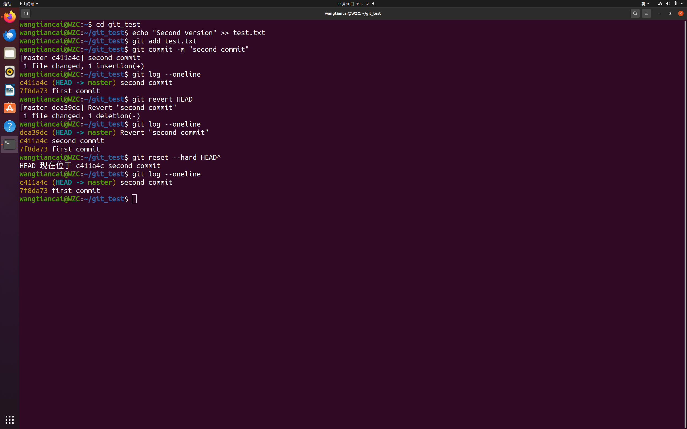
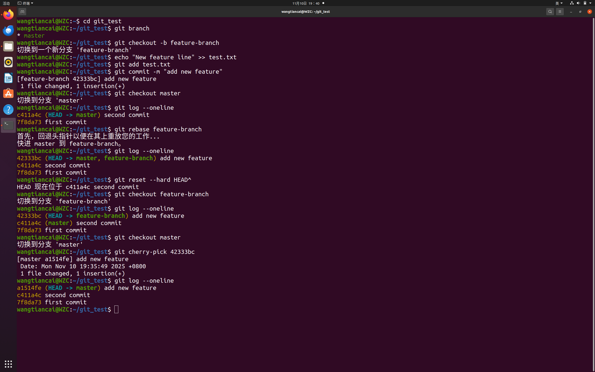

题目1:回退到上部分

方法一：git restore

git restore --staged <文件名>
git restore <文件名>
方法二：git reset
git reset --hard HEAD

题目二，回退已提交版本
方法一：不修改历史：git revert
git revert <commit_id>
方法二：修改历史：git reset
git reset --hard HEAD^

题目三：合并分枝的其他方法：
方法一：用git rebase
git rebase <分支名>
方法二：用git cherry pick
git cherry-pick <commit_id>

