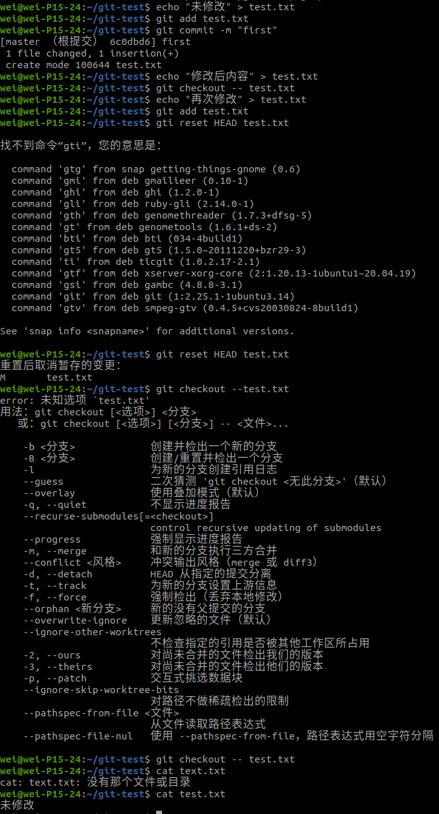
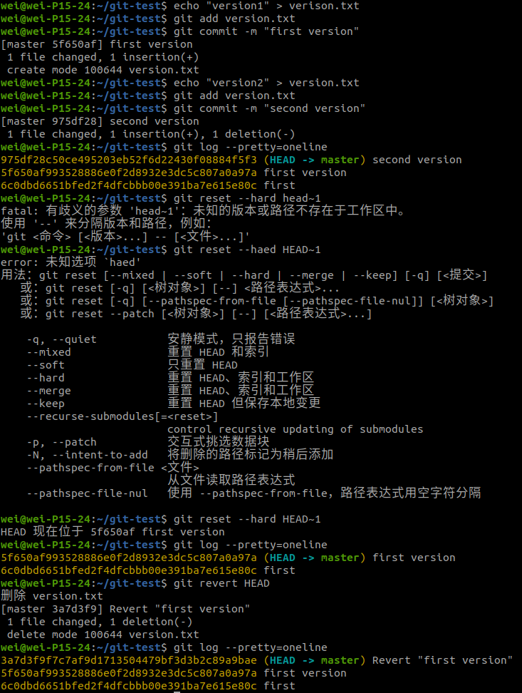

# #git 应用

## 问题1：回退修改

第一种方式：git checkout -- <file>

第二种方式：git reset HEAD <file>

​			git checkout -- <file>

## 问题2：回退版本

第一种方式：git reset --hard <commit>

第二种方式：git revert <commit>

## 问题3：合并分支

第一种方式：git merge

第二种方式：git rebase

